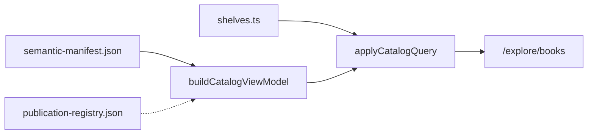

# Contributing to the books catalog

The `/explore/books` page is a filterable library built from the semantic manifest only.

## Data flow



- **Source of truth for book content:** `data/semantic-manifest.json` (ISR from `ksteffe/after-certainty` releases).
- **Publication registry:** `data/publication-registry.json` — work/edition resolution overlays (IDs, canonical flags, companion/supersession links, optional dates). Does **not** duplicate titles, covers, or download URLs.
- **Resolution layer (Phase B):** `lib/books/resolve-work-edition.ts` prefers the registry and falls back to `-vN` heuristics for unregistered books. Catalog, search, and validation consume this resolver.
- **Join layer:** `lib/books/catalog-view-model.ts` normalizes graph books into `CatalogBookView`.
- **Editorial shelves:** `lib/books/shelves.ts` — curated slug lists and small rule-based shelves.
- **Taxonomy:** `lib/books/catalog-taxonomy.ts` — content-type slug map and recommended sort order.

## Adding a book to a curated shelf

Edit `lib/books/shelves.ts` and append the book **slug only** to the relevant `bookSlugs` array. Run `npm test -- lib/books/catalog-query.test.ts` to catch unknown slugs.

When a new book appears in the semantic manifest, also add a matching entry to `data/publication-registry.json`:

| Field             | Guidance                                                          |
| ----------------- | ----------------------------------------------------------------- |
| `bookId` / `slug` | Must match the graph book exactly                                 |
| `workId`          | `work-{slug}` for sole editions; shared id for multi-volume works |
| `isCanonical`     | `true` for the public primary edition                             |
| `relationship`    | `sole`, `primary`, `companion`, or `superseded`                   |

Run:

```bash
npm test -- lib/books/validate-publication-registry.test.ts lib/books/publication-registry-schema.test.ts
```

## Content types

Fiction and handbook labels are editorial until upstream adds `contentType`. Update `CONTENT_TYPE_BY_SLUG` in `catalog-taxonomy.ts`.

## Canonical editions and companions

**Resolution** uses `lib/books/resolve-work-edition.ts` + `data/publication-registry.json` (heuristics in `canonical-editions.ts` only for unregistered books).

**Registry policy:**

- Each intellectual **work** has exactly one canonical public **edition**.
- **Companion** volumes (e.g. When Others Look to You v2) share a `workId`, are **not** canonical for the default catalog, and must **not** be labeled superseded.
- **Superseded** requires an explicit `supersededByEditionId` — never infer supersession from `-vN` alone.
- WoLTY: `work-when-others-look-to-you`; v1 = primary/canonical; v2 = companion.

Default catalog hides non-canonical siblings. Append `?editions=all` to reveal them. Companions remain in the sitemap and on detail URLs.

## Status and edition labels (Phase C)

- Catalog cards show at most **one** exceptional chip (Upcoming, Companion edition, or Earlier edition) beside the content type. Primary/sole labels are omitted on cards.
- Book detail pages use `EditionNotice` for companion, superseded, and upcoming callouts, with tracked links to the related volume.
- Shared helpers live in `lib/books/public-status.ts`; UI in `components/books/status-label.tsx` and `edition-notice.tsx`.

## URL parameters

| Param          | Purpose                                            |
| -------------- | -------------------------------------------------- |
| `shelf`        | Narrow to one shelf slug                           |
| `type`         | Comma-separated content types                      |
| `status`       | `published` or `upcoming`                          |
| `availability` | `online`, `download`, `print`, `open`              |
| `sort`         | `recommended` (default), `title-asc`, `title-desc` |
| `q`            | Title/metadata substring search                    |
| `editions`     | `all` to include non-canonical editions            |

Filtered views set `alternates.canonical` to `/explore/books`.

## Validation

`lib/books/validate-catalog.ts` fails the build on:

- Unknown shelf slugs, duplicate IDs, non-canonical editions on curated shelves, draft books on public shelves
- Publication-registry health errors (coverage, multiple canonicals, WoLTY companion policy)

Sitemap book URLs exclude drafts (`bookIsPublic`).

## Local preview

```bash
npm run dev
```

Use the refresh-manifest skill when upstream semantic data changes. After refreshing the manifest, ensure every new book has a publication-registry row.
