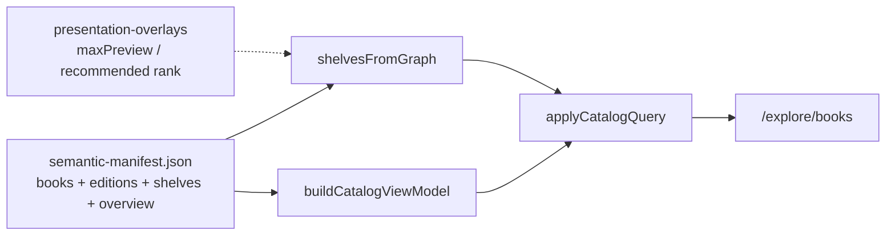

# Contributing to the books catalog

The `/explore/books` page is a filterable library built from the semantic manifest.

## Data flow



- **Source of truth:** after-certainty release → `semantic-manifest.json` (ISR + bundled fallback).
- **Editions / works:** `editions[]` / `works[]` (and additive fields on `books[]`).
- **Shelves:** `shelves[]` from the manifest; site merges `maxPreview` from [`lib/books/presentation-overlays.ts`](../lib/books/presentation-overlays.ts).
- **Content type:** `books[].contentType` from the manifest; display labels + recommended sort stay in [`lib/books/catalog-taxonomy.ts`](../lib/books/catalog-taxonomy.ts).
- **Front-shelf doorway copy:** [`lib/start/front-shelf.ts`](../lib/start/front-shelf.ts) (presentation only).

## Adding a book to a curated shelf

Author the shelf in after-certainty `semantic/shelves/*.yml`, release, and refresh the bundled manifest. Do not hardcode corpus shelf membership in this repo.

Site-only: adjust `SHELF_MAX_PREVIEW_BY_SLUG` if a preview limit should change.

## Content types

Set `content_type` on `book.yml` upstream. The site reads `books[].contentType`
(and optional `literaryForm`) through the centralized adapter in
[`lib/graph/content-type.ts`](../lib/graph/content-type.ts). See
[`docs/semantic-manifest.md`](semantic-manifest.md).

Do not add title-based type mappings in this repository.

## Canonical editions and companions

**Resolution** uses `lib/books/resolve-work-edition.ts` with `graph.editions` (heuristics in `canonical-editions.ts` only when editions are absent).

**Policy:**

- Each intellectual **work** has exactly one canonical public **edition**.
- **Companion** volumes share a `workId`, are **not** canonical for the default catalog, and must **not** be labeled superseded.
- **Superseded** requires an explicit `supersededByEditionId`.
- WoLTY: `work-when-others-look-to-you`; v1 = primary/canonical; v2 = companion.

Default catalog hides non-canonical siblings. Append `?editions=all` to reveal them in the flat results pool (and search/sitemap still include public companions).

### Companions on shelves

**Shelves show public canonical editions only.** `resolveShelfBooks` drops companions and superseded editions even when a curated shelf lists them, and even when `?editions=all` is set.

Curated shelf membership for a non-canonical edition is a **catalog integrity error** unless listed in
[`data/shelf-edition-exceptions.json`](../data/shelf-edition-exceptions.json)
(temporary operational allowlist — excepted rows become warnings with a reason). Prefer fixing the shelf in after-certainty; shrink the exception file when upstream catches up.

Companions remain reachable via book detail (edition notice), direct URL, search (demoted), and sitemap.

## Book overviews

Orientation fields live on `books[].overview` from after-certainty. See [`docs/contributing-book-overviews.md`](contributing-book-overviews.md).

## URL parameters

| Param          | Purpose                                            |
| -------------- | -------------------------------------------------- |
| `shelf`        | Narrow to one shelf slug                           |
| `type`         | Comma-separated content types                      |
| `status`       | `published` or `upcoming`                          |
| `availability` | `online`, `download`, `print`, `open`              |
| `sort`         | `recommended` (default), `title-asc`, `title-desc` |
| `q`            | Title/metadata substring search                    |
| `editions`     | `all` to include non-canonical editions            |

Filtered views set `alternates.canonical` to `/explore/books`.

## Validation

```bash
npm test -- lib/books/catalog-query.test.ts lib/books/validate-publication-registry.test.ts
```

## Local preview

```bash
npm run dev
```

Use the refresh-manifest skill when upstream semantic data changes.
