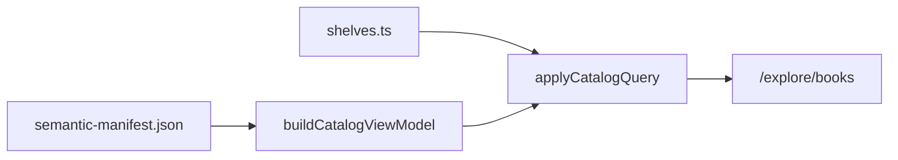

# Contributing to the books catalog

The `/explore/books` page is a filterable library built from the semantic manifest only.

## Data flow



- **Source of truth:** `data/semantic-manifest.json` (ISR from `ksteffe/after-certainty` releases).
- **Join layer:** `lib/books/catalog-view-model.ts` normalizes graph books into `CatalogBookView`.
- **Editorial shelves:** `lib/books/shelves.ts` — curated slug lists and small rule-based shelves.
- **Taxonomy:** `lib/books/catalog-taxonomy.ts` — content-type slug map and recommended sort order.

## Adding a book to a curated shelf

Edit `lib/books/shelves.ts` and append the book **slug only** to the relevant `bookSlugs` array. Run `npm test -- lib/books/validate-catalog.ts` (via `catalog-query.test.ts`) to catch unknown slugs.

## Content types

Fiction and handbook labels are editorial until upstream adds `contentType`. Update `CONTENT_TYPE_BY_SLUG` in `catalog-taxonomy.ts`.

## Canonical editions

Edition groups use slug suffixes (`-vN`) and companion links. Default catalog hides non-canonical siblings (e.g. WoLTY v2). Append `?editions=all` to reveal superseded editions.

## URL parameters

| Param          | Purpose                                            |
| -------------- | -------------------------------------------------- |
| `shelf`        | Narrow to one shelf slug                           |
| `type`         | Comma-separated content types                      |
| `status`       | `published` or `upcoming`                          |
| `availability` | `online`, `download`, `print`, `open`              |
| `sort`         | `recommended` (default), `title-asc`, `title-desc` |
| `q`            | Title/metadata substring search                    |
| `editions`     | `all` to include superseded editions               |

Filtered views set `alternates.canonical` to `/explore/books`.

## Validation

`lib/books/validate-catalog.ts` fails the build on:

- Unknown shelf slugs, duplicate IDs, superseded editions on curated shelves, draft books on public shelves

Warnings (non-blocking): empty shelves, missing covers/descriptions, books on no shelf.

## Local preview

```bash
npm run dev
```

Use the refresh-manifest skill when upstream semantic data changes.
