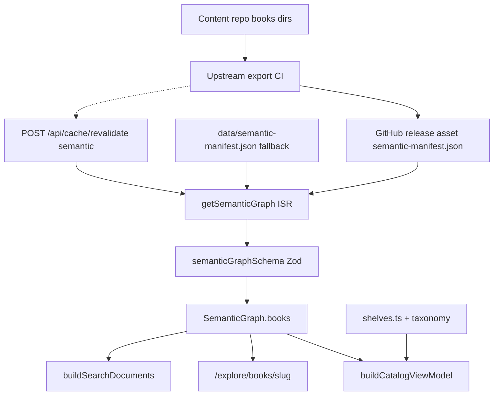
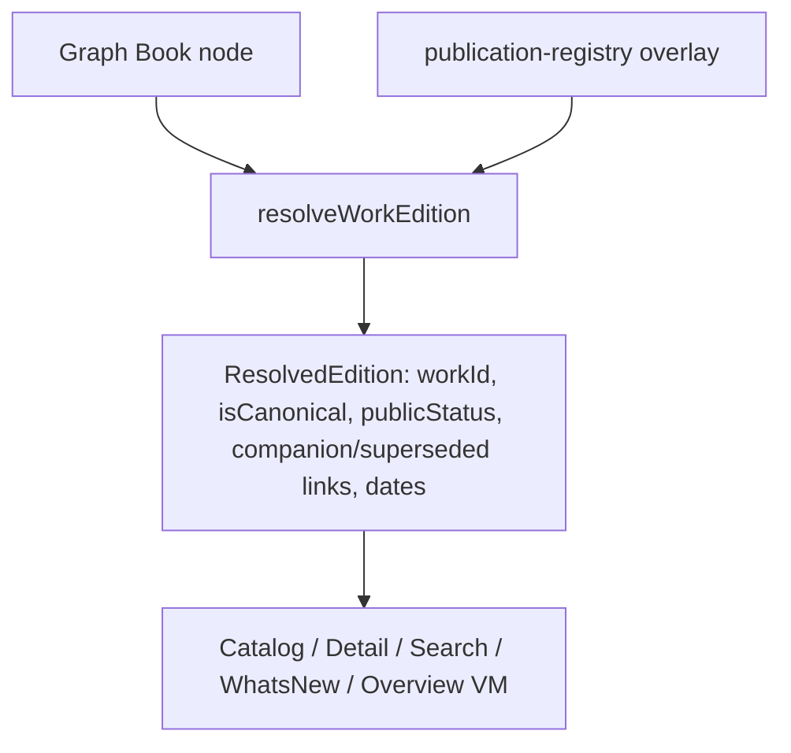
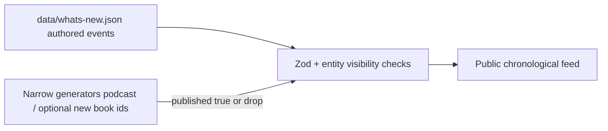

# Canonical Editions, What’s New, and Book Overviews — Product, Content, UX, and Technical Plan

**Deliverable path:** [`docs/roadmaps/canonical-status-whats-new-book-overviews-plan.md`](canonical-status-whats-new-book-overviews-plan.md)  
**Location rationale:** The repo stores product and architecture plans under [`docs/roadmaps/`](./) (e.g. [`start-with-a-question-plan.md`](start-with-a-question-plan.md), [`global-search-plan.md`](global-search-plan.md)). Contributing guides live at [`docs/`](../). This document follows that convention.

**Status:** Planning complete. **Phases A–H landed** — publication registry, resolution, status/edition labels, What’s New, book overview content model, redesigned overview IA, and book ↔ What’s New cross-links with trail/search consistency polish.

**Scope of this document:** Product and technical plan. Implementation proceeds in phases A–H.

**Legend:** Statements marked **(fact)** are grounded in the repository as inspected. Statements marked **(judgment)** are product or architecture recommendations.

---

## 1. Executive summary

After Certainty’s public site (`after-certainty-site`) is a **Next.js 16 App Router** application that consumes a semantic graph from the content repository `ksteffe/after-certainty`. As the catalog grows, visitors need reliable answers to: which edition am I viewing, is it current, is it published or upcoming, when did it meaningfully change, what question does this book investigate, and what changed recently across the project.

These three features share one prerequisite: **normalized canonical and publication metadata**.

**Recommended progression (judgment):**

1. Reliable canonical and status metadata
2. Trustworthy chronological updates (`/whats-new`)
3. Clearer book overview pages

**Facts from repository:**

- Stack: Next.js **16.2.10**, React **19.2.7**, Tailwind 4, TypeScript; deployed on Vercel with ISR (`fetch` revalidate ≈ 3600s, cache tag `semantic-graph`).
- Books originate in the **content repo**; this site consumes `semantic-manifest.json` (remote release + bundled [`data/semantic-manifest.json`](../../data/semantic-manifest.json)).
- Bundled graph currently has **31 books**, all `status: "published"`, all `year: 2026`, all `publicationDate: null`.
- There is **no `workId` / `editionId` model**. Edition grouping is inferred from `-vN` slug suffixes and companion fields in [`lib/books/canonical-editions.ts`](../../lib/books/canonical-editions.ts).
- The only multi-edition slug group is **When Others Look to You** (`when-others-look-to-you-v1` / `v2`).
- There is **no What’s New route**, changelog entity, or publication-event stream.
- Book detail pages expose cover, summary, downloads, media, adjacent books, trails, and large semantic inventories — not orientation fields such as central question, audience, or revision history.
- Chapter lists, word counts, and TOC data are **absent** from the semantic manifest.
- Site-authored manifests already exist for questions and trails — a proven pattern for editorial overlays without a CMS.

**Technical recommendation (judgment):** Introduce a **lightweight Work/Edition resolution layer** with an interim site-side publication registry (IDs and flags only — no duplicated titles/covers), then authored What’s New events and book-overview overlays. Keep static/low-backend architecture. No auth, CMS, runtime database, or generative AI.

**Smallest independently shippable slice (judgment):** Explicit canonical resolution + public status/edition labels on existing catalog and detail pages (Phases B–C), before What’s New or overview redesign.

---

## 2. Current architecture

### 2.1 Application stack (fact)

| Concern       | State                                                                                                                                                                                                               |
| ------------- | ------------------------------------------------------------------------------------------------------------------------------------------------------------------------------------------------------------------- |
| Framework     | Next.js 16 App Router, React 19, TypeScript, Tailwind v4                                                                                                                                                            |
| Rendering     | RSC default; ISR via `fetch` + `revalidate` / `revalidateTag`; React `cache()` dedup; client islands for catalog controls, search, analytics, Observatory, theme, consent                                           |
| Static params | No `generateStaticParams` for book slugs                                                                                                                                                                            |
| Backend       | Route handlers only: [`app/api/cache/revalidate`](../../app/api/cache/revalidate), [`app/api/search/index`](../../app/api/search/index), JSON-LD routes, [`app/feed.xml`](../../app/feed.xml) → Anchor RSS redirect |
| Hosting       | Vercel; no `vercel.json`; CI in [`.github/workflows/ci.yml`](../../.github/workflows/ci.yml)                                                                                                                        |
| Tests         | Vitest + Testing Library; Playwright E2E                                                                                                                                                                            |
| Analytics     | Consent-gated GA4 ([`lib/analytics/events.ts`](../../lib/analytics/events.ts)) + Vercel Analytics + Speed Insights                                                                                                  |
| Design system | Local tokens ([`styles/tokens.css`](../../styles/tokens.css)) + thin primitives (`components/ui/*`); Cormorant Garamond + Source Sans 3; no shadcn Badge/Tabs library                                               |
| a11y patterns | Skip link, dialog patterns, `focus-visible:ring-accent`, labeled navs, search listbox/`aria-live`                                                                                                                   |

### 2.2 Routing conventions (fact)

| Route                                                    | Role                                                                           |
| -------------------------------------------------------- | ------------------------------------------------------------------------------ |
| `/explore/books`                                         | Filterable catalog                                                             |
| `/explore/books/[slug]`                                  | Book detail / overview                                                         |
| `/books`, `/books/:slug`                                 | Permanent redirects → explore paths ([`next.config.ts`](../../next.config.ts)) |
| `/questions`, `/trails`, `/search`, `/podcast`, `/start` | Adjacent discovery surfaces                                                    |
| What’s New                                               | **Does not exist**                                                             |

Canonical book path helper: `explorePaths.books` → `/explore/books` ([`lib/graph/explorePaths.ts`](../../lib/graph/explorePaths.ts)).

### 2.3 Content repository boundaries (fact)

| Lives in content repo (`ksteffe/after-certainty`)                                                  | Lives in site repo                                                     |
| -------------------------------------------------------------------------------------------------- | ---------------------------------------------------------------------- |
| Books, glossary, patterns, situations, sources, thinkers, relationships → `semantic-manifest.json` | Trails, questions, search aliases, contributors, shelves, taxonomy, UI |
| GitHub release asset + optional CI revalidate POST                                                 | Next.js app, design, analytics                                         |

This site **does not** transform manuscripts into manifests. Local scripts only include OG image generation (`scripts/generate-og.mjs`).

### 2.4 Existing helpers and tooling (fact)

| Concern               | Location                                                                                                                      |
| --------------------- | ----------------------------------------------------------------------------------------------------------------------------- |
| Metadata / SEO        | [`lib/metadata.ts`](../../lib/metadata.ts), [`lib/seo/json-ld.ts`](../../lib/seo/json-ld.ts)                                  |
| Canonical origin      | [`lib/site-config.ts`](../../lib/site-config.ts) `resolveDeploymentUrl()`                                                     |
| Book slug aliases     | [`lib/books/book-slugs.ts`](../../lib/books/book-slugs.ts)                                                                    |
| Edition heuristics    | [`lib/books/canonical-editions.ts`](../../lib/books/canonical-editions.ts)                                                    |
| Status / availability | [`lib/books/book-metadata.ts`](../../lib/books/book-metadata.ts)                                                              |
| Catalog VM            | [`lib/books/catalog-view-model.ts`](../../lib/books/catalog-view-model.ts)                                                    |
| Catalog health        | [`lib/books/validate-catalog.ts`](../../lib/books/validate-catalog.ts)                                                        |
| Sitemap / robots      | [`app/sitemap.ts`](../../app/sitemap.ts), [`app/robots.ts`](../../app/robots.ts)                                              |
| Date formatting       | Podcast: [`lib/podcast/format.ts`](../../lib/podcast/format.ts); footer uses `generatedAt`; **no shared book date formatter** |
| Manifest Zod          | [`lib/graph/schemas.ts`](../../lib/graph/schemas.ts)                                                                          |
| UI: breadcrumbs       | [`components/explore/breadcrumb-trail.tsx`](../../components/explore/breadcrumb-trail.tsx)                                    |
| UI: cards             | [`components/books/catalog-book-card.tsx`](../../components/books/catalog-book-card.tsx), explore cards                       |
| Status badges         | Inline spans on catalog cards / path stops — **no shared Badge component**                                                    |

---

## 3. Current book-data flow

### Ownership answers (judgment, grounded in facts)

| Question                                       | Owner                                                                                                             |
| ---------------------------------------------- | ----------------------------------------------------------------------------------------------------------------- |
| Where book information originates              | Content repo → `semantic-manifest.json`                                                                           |
| Which scripts transform it                     | Upstream export CI (not in this site repo)                                                                        |
| Which artifacts the site consumes              | Remote + bundled semantic manifest; site shelves/taxonomy; questions/trails manifests                             |
| Which layer should own canonical status        | **Upstream book fields preferred**; interim **site publication registry** for explicit flags until upstream ships |
| Which layer should own public change events    | **Site-authored** `data/whats-new.json` (+ narrow auto-candidates)                                                |
| Which layer should assemble book overview data | Site **view-model** joining graph book + overview overlay + resolved status/edition                               |

**Deprecated / misleading docs (fact):** README and older roadmaps still mention `books-manifest.json` / `lib/books/manifest.ts`. Those files are absent. [`getOngoingWorks()`](../../lib/content-data.ts) returns `[]`.

---

## 4. Metadata audit

### 4.1 Inventory of book fields

| Field                                | Origin                                   | Authored / generated | Complete?                                     | Reliable?                                 | Public?                                    | Duplicated?                         | Normalize before features?                                  |
| ------------------------------------ | ---------------------------------------- | -------------------- | --------------------------------------------- | ----------------------------------------- | ------------------------------------------ | ----------------------------------- | ----------------------------------------------------------- |
| `id` (`book-<slug>`)                 | Upstream                                 | Authored/export      | Yes (31 unique)                               | Yes as edition id                         | Yes                                        | No                                  | Keep as **edition id**                                      |
| `slug`                               | Upstream                                 | Authored             | Yes                                           | Yes                                       | Yes                                        | No                                  | Keep; edition-level URL                                     |
| `workId`                             | **Absent**                               | —                    | No                                            | —                                         | —                                          | —                                   | **Add** (registry/upstream)                                 |
| `editionId` distinct from `id`       | **Absent**                               | —                    | N/A                                           | —                                         | —                                          | —                                   | Use existing `id` as edition id                             |
| Title                                | Upstream                                 | Authored             | Yes                                           | Yes                                       | Yes                                        | summary≈description often           | Keep on edition                                             |
| Previous title                       | **Absent**                               | —                    | No                                            | —                                         | —                                          | —                                   | Add only when renames occur                                 |
| Subtitle                             | Upstream                                 | Authored             | Partial                                       | Yes when present                          | Yes                                        | No                                  | Keep                                                        |
| `summary` / `description`            | Upstream                                 | Authored             | Mostly                                        | Often identical                           | Yes                                        | **Yes — often duplicate**           | Prefer `summary`; treat description as optional longer copy |
| Cover / OG image                     | Upstream                                 | Authored             | Mostly                                        | Yes                                       | Yes                                        | Path variants stripped by Zod       | Keep                                                        |
| Work type / fiction                  | Site taxonomy                            | Editorial map        | Partial                                       | Editorial                                 | Yes                                        | Not in manifest                     | Keep site map until upstream                                |
| Series                               | **Absent**                               | —                    | No                                            | —                                         | —                                          | —                                   | Optional later; shelves approximate                         |
| `publicationDate`                    | Upstream field                           | Authored             | **All null**                                  | Unusable                                  | Intended public                            | —                                   | **Must populate** for What’s New / SEO                      |
| `year`                               | Upstream                                 | Authored             | All `2026`                                    | Coarse only                               | Yes                                        | —                                   | Keep as fallback                                            |
| Last modified / substantial revision | **Absent**                               | —                    | No                                            | —                                         | —                                          | —                                   | **Authored `revisedAt`** — never file mtime                 |
| `status`                             | Upstream                                 | Authored             | Present; all published                        | Enum reliable; corpus unused for upcoming | Partial                                    | Collapsed in UI                     | Map public vocabulary                                       |
| Visibility / draft                   | Derived `bookIsPublic`                   | Derived              | Draft filter exists                           | Drafts not currently in bundle            | Internal draft hidden from catalog default | Sitemap lists all books             | Filter drafts from sitemap                                  |
| Edition number/label                 | Derived from `-vN`                       | Derived              | Only WoLTY                                    | Heuristic                                 | Partial                                    | —                                   | Prefer explicit labels                                      |
| Canonical edition                    | Derived heuristic                        | Derived              | WoLTY special-cased                           | **Fragile**                               | Catalog hides non-canonical                | Hard-code vs highest `-vN` conflict | **Must normalize**                                          |
| Superseded / replacement             | Derived (non-canonical sibling)          | Derived              | Conflated with companion                      | **Unreliable**                            | Catalog `?editions=all`                    | —                                   | Explicit replacement links only                             |
| Companion                            | `companionBooks` / `companionOf` (slugs) | Authored             | WoLTY only                                    | Directionally correct                     | Yes                                        | Ref style ≠ `relatedBooks` ids      | Keep; separate from supersession                            |
| Formats EPUB/PDF/DOCX                | Upstream                                 | Authored             | Nearly complete; observer-patterns PDF-only   | Yes                                       | Yes                                        | —                                   | Keep                                                        |
| Print / purchase                     | `purchaseLinks` + `isbns`                | Authored             | 3 books                                       | Yes                                       | Yes                                        | —                                   | Keep                                                        |
| Online reading                       | **Absent** as distinct mode              | —                    | N/A                                           | —                                         | —                                          | Derived “online” from export URL    | Clarify: downloads ≠ in-browser reader                      |
| “Open”                               | Derived if any export URL                | Derived              | Over-applied                                  | **Misleading as status**                  | Shown as availability                      | —                                   | Treat as licensing model                                    |
| Word/page count                      | **Absent**                               | —                    | No                                            | —                                         | —                                          | —                                   | Defer                                                       |
| Chapter list                         | **Absent**                               | —                    | No                                            | —                                         | —                                          | —                                   | Defer book-map until upstream TOC                           |
| Concepts / patterns / sources        | Upstream id lists                        | Authored/export      | Uneven (8 books have 0 concepts & 0 patterns) | IDs reliable when present                 | Yes                                        | Related lists can be large          | Curate on overview; disclose rest                           |
| Thinkers                             | Derived/resolved from sources            | Generated/enriched   | Depends on enrichment                         | Improving with manifest v2                | Yes                                        | —                                   | Curate on overview                                          |
| Related books / reading order        | Companions + shelves + questions         | Mixed                | Partial                                       | Editorial shelves not true reading order  | Yes                                        | —                                   | Authored `readBefore`/`readNext`                            |
| Featured                             | Site `getFeaturedBook` + shelves         | Editorial            | One homepage feature                          | Editorial                                 | Yes                                        | —                                   | Keep separate from status                                   |

### 4.2 Ambiguous cases found (fact + judgment)

| Case                                        | Fact                                                                                   | Judgment                                            |
| ------------------------------------------- | -------------------------------------------------------------------------------------- | --------------------------------------------------- |
| Multiple public records with similar titles | WoLTY v1 and v2                                                                        | Model as **companion volumes**, not superseded pair |
| Rewritten / alternate subtitle              | WoLTY v2 different subtitle                                                            | Companion edition identity                          |
| Renamed books                               | Alias `when-others-look-to-you` → v1; microsite redirects in `next.config.ts`          | Preserve aliases; do not invent renames             |
| Old pages that still resolve                | Alias redirect on detail; legacy `/books/*` redirects                                  | Keep stable URLs                                    |
| Upcoming in semantic data                   | Status enum + upcoming shelf exist; **bundle has zero upcoming**                       | Keep plumbing; populate when real                   |
| Complete but not published                  | Not represented in current bundle                                                      | Use `upcoming` / withhold until published           |
| Downloads but not print                     | Most books                                                                             | Availability: download without print                |
| Open edition meaning unclear                | Site copy says Open Publishing / CC BY-SA; availability flag `"open"` = has export URL | **Licensing model**, not status badge               |
| Modified dates = technical                  | `generatedAt` is graph rebuild time                                                    | Never use as revision date                          |
| Books with empty semantic inventory         | e.g. `observer-patterns`, fiction titles                                               | Overview must not require large concept grids       |
| Partial formats                             | `observer-patterns` PDF only                                                           | Primary action must handle sparse formats           |
| Docs drift                                  | `books-manifest.json` referenced but absent                                            | Update contributing docs during implementation      |

---

## 5. Identified inconsistencies

1. **Companion conflated with supersession (most serious):** `companionOf` marks WoLTY v2 as companion, while `-vN` grouping + non-canonical filter treat it like a superseded edition.
2. **Canonical heuristic conflict:** WoLTY hard-codes v1; generic rule prefers highest `-vN`.
3. **`publicationDate` always null** while SEO/JSON-LD falls back to year `2026`.
4. **“Open” availability** inferred from downloads, not licensing authorship.
5. **Sitemap includes all book slugs** including non-canonical companions; default catalog hides them.
6. **Companion refs use slugs; `relatedBooks` elsewhere use ids.**
7. **Dual Book types:** legacy [`types/content.ts`](../../types/content.ts) vs live [`types/semanticGraph.ts`](../../types/semanticGraph.ts).
8. **`themes` on catalog view always `[]`.**
9. **Status UI exists for upcoming**, but no upcoming books in current data — risk of untested paths.
10. **Homepage “Recent work”** is not chronological project news.

---

## 6. Canonical work and edition model

### 6.1 Do we need Work and Edition? (judgment)

**Yes, lightly.** The corpus already has edition-level graph nodes and one companion pair. A full CMS catalog is unnecessary. A lighter model that only “picks the newest `-vN`” is **insufficient** because it disagrees with WoLTY and cannot express companion vs replacement.

### 6.2 Smallest useful model

**Work** (intellectual object):

| Field              | Required | Notes                                              |
| ------------------ | -------- | -------------------------------------------------- |
| `workId`           | Yes      | Stable string, e.g. `work-when-others-look-to-you` |
| `currentEditionId` | Yes      | Points to canonical public edition `Book.id`       |
| `visibility`       | Yes      | `public` \| `hidden`                               |
| `relatedWorkIds`   | No       | Companions / family links at work level            |

**Edition** (existing `Book` node + overlays):

| Field                      | Required                           | Notes                                |
| -------------------------- | ---------------------------------- | ------------------------------------ |
| `id` / `slug`              | Yes                                | Existing graph identity              |
| `workId`                   | Yes                                | Join key                             |
| `isCanonical`              | Yes when multi-edition or explicit | Authored; not inferred as sole truth |
| `editionLabel`             | When non-default                   | e.g. `v1`, `Companion`               |
| `title` / `subtitle`       | Yes                                | On edition (titles can change)       |
| `status`                   | Yes                                | Upstream workflow status             |
| `firstPublishedAt`         | Preferred                          | ISO date                             |
| `revisedAt`                | When substantial revision          | ISO date; authored                   |
| `supersededByEditionId`    | When replaced                      | Explicit only                        |
| `replacesEditionId`        | Optional inverse                   | Validation aid                       |
| `companionOf` / companions | When parallel volume               | Not supersession                     |
| Formats / purchase / cover | As today                           | Do not duplicate in registry         |

### 6.3 Where authored (judgment)

1. **Preferred long-term:** upstream semantic book fields.
2. **Interim in this site:** [`data/publication-registry.json`](../../data/publication-registry.json) keyed by existing book `id` or `slug`, storing **only** resolution fields and dates — **never** titles, covers, summaries, or download URLs.
3. Site resolvers merge registry over graph; validation fails on conflicts (e.g. two canonicals).

### 6.4 URL mapping (judgment)

| Situation                         | Behavior                                                                                                                  |
| --------------------------------- | ------------------------------------------------------------------------------------------------------------------------- |
| Canonical edition                 | `/explore/books/{slug}` is the overview URL                                                                               |
| Alias slug                        | Continue `permanentRedirect` to canonical slug                                                                            |
| Companion edition                 | Remains addressable; notice links to primary volume                                                                       |
| True superseded edition           | Remains addressable with prominent notice + link to current (**prefer notice over silent redirect** so citations survive) |
| Rename same edition               | Update title fields; keep slug                                                                                            |
| Rewrite under new public identity | New edition slug + alias/redirect from old                                                                                |

### 6.5 Revision vs new edition (judgment)

- Typo / formatting / export rebuild → **same edition**, no public event, no `revisedAt`.
- Substantial editorial revision with public meaning → **same edition** + `revisedAt` + `changeSummary` + What’s New `book_revised` (unless product decides a new `-vN` edition).
- Materially different public volume (companion or replacement) → **new edition node**.

### 6.6 Canonical conflict detection (judgment)

Build-time errors when:

- More than one `isCanonical` per `workId`
- Canonical edition is draft/hidden
- Superseded edition marked canonical
- Circular `supersededBy` / `replaces` links
- Registry references unknown book ids

Heuristics in [`canonical-editions.ts`](../../lib/books/canonical-editions.ts) remain **fallback only** for single-edition works and until registry coverage is complete.

---

## 7. Public status vocabulary

### 7.1 Internal vs public

| Internal (`BookStatus`)                       | Public visitor language                                |
| --------------------------------------------- | ------------------------------------------------------ |
| `draft`                                       | **Not exposed**                                        |
| `forthcoming`, `in_progress`, `collaborative` | **Upcoming** (one public word)                         |
| `published`                                   | **Published** (usually omitted on cards when ordinary) |

Additional **public presentation states** (not raw status enum values):

| State          | Meaning                                     |
| -------------- | ------------------------------------------- |
| **Revised**    | Published edition with authored `revisedAt` |
| **Companion**  | Parallel volume (`companionOf` / registry)  |
| **Superseded** | Explicitly replaced edition                 |

### 7.2 Label definitions

| Label        | Display language                                    | Required metadata       | Where it appears                                              | Filterable?      | Affects canonical?                | Search?               | Cards?                     | Detail?       | What’s New?              |
| ------------ | --------------------------------------------------- | ----------------------- | ------------------------------------------------------------- | ---------------- | --------------------------------- | --------------------- | -------------------------- | ------------- | ------------------------ |
| Published    | Usually no badge                                    | `status=published`      | Metadata                                                      | Yes (catalog)    | No                                | Boost                 | No (default)               | Dates in meta | As event type            |
| Upcoming     | “Upcoming”                                          | upcoming statuses       | Cards, detail, search demotion                                | Yes              | No canonical downloads as primary | Demote                | Yes                        | Yes           | `book_announced`         |
| Revised      | “Revised edition” or “Substantially revised {date}” | `revisedAt`             | Detail, What’s New; card only if recent/notable               | Optional later   | No                                | Slight boost optional | Sparse                     | Yes           | `book_revised`           |
| Companion    | “Companion edition”                                 | companion link          | Cards when in multi-volume family; detail notice              | No V1            | Not superseded                    | Listed                | Yes when relevant          | Yes           | Rare                     |
| Superseded   | “This edition has been superseded”                  | `supersededByEditionId` | **Prominent detail notice**; catalog only with `editions=all` | Via editions=all | Must not be canonical             | Demote                | Optional “Earlier edition” | Yes           | Link from revision event |
| Open edition | Not a status badge                                  | Licensing copy / about  | Formats blurb / about                                         | No               | No                                | No                    | No                         | Short note OK | No                       |

---

## 8. Availability model

Availability is **orthogonal** to publication status.

| Flag / action          | Meaning                    | Source today                     | Change                                                                                                                                                                           |
| ---------------------- | -------------------------- | -------------------------------- | -------------------------------------------------------------------------------------------------------------------------------------------------------------------------------- |
| Download EPUB/PDF/DOCX | File available             | `BookFormatAsset`                | Keep; show file type labels                                                                                                                                                      |
| Print / buy            | Purchase link              | `purchaseLinks`                  | Keep                                                                                                                                                                             |
| Read online            | In-browser reader          | **Absent**                       | Do not claim “Read online” unless a real reader exists **(judgment: remove misleading derived “online” from visitor-facing availability, or redefine as “Available digitally”)** |
| Open / open edition    | CC BY-SA / Open Publishing | Site prose; wrongly derived flag | Licensing note, not status                                                                                                                                                       |
| Podcast companion      | Episode exists             | Podcast data + editorial link    | Optional secondary action                                                                                                                                                        |

**Primary action rules (judgment):**

1. Upcoming → no download pretenses; CTA to related published work or “Announced” state.
2. Superseded → primary CTA “Continue to the current edition”.
3. Companion → primary = this volume’s best download; secondary = “Primary volume”.
4. Otherwise → one primary among: purchase (if print-first editorial preference), else first enabled PDF/EPUB/DOCX in a stable order.
5. Remaining formats in a secondary group.

---

## 9. Canonical resolution rules

**Rules (judgment):**

1. Single-edition public works are canonical by default.
2. Multi-edition works require exactly one authored canonical edition.
3. Companion volumes are public and non-canonical for catalog default **without** superseded language.
4. Superseded editions require explicit replacement links.
5. Drafts are non-public: excluded from default catalog, sitemap, What’s New, and overview promotion.
6. Alias resolution continues via `slugAliases` + redirects.
7. One resolver module serves all surfaces — cards must not reimplement rules.

**WoLTY concrete resolution (judgment grounded in companion fields):**

- `workId`: `work-when-others-look-to-you`
- Canonical / primary: `when-others-look-to-you-v1`
- `when-others-look-to-you-v2`: companion edition, public, not superseded
- Alias `when-others-look-to-you` → v1

---

## 10. Status and edition-label UX

### 10.1 Display hierarchy (judgment)

1. **Primary public status** only when needed (Upcoming; Superseded notice; Companion when distinguishing).
2. **Edition note** only when more than one public volume exists for the work family.
3. **Availability** separate from status (download/print text, not five badges).
4. **Superseded warnings** prominent on old pages — not tiny badges.

Avoid badge overload: catalog cards should rarely show more than **one** exceptional status chip plus content type.

### 10.2 Recommended language

| State                            | Language                                                                                 |
| -------------------------------- | ---------------------------------------------------------------------------------------- |
| Canonical in multi-volume family | “Primary volume” or omit if obvious                                                      |
| Companion                        | “Companion edition”                                                                      |
| Superseded                       | “This edition has been superseded” + “Continue to the current edition”                   |
| Upcoming                         | “Upcoming”                                                                               |
| Revised                          | “Substantially revised {Month Year}”                                                     |
| First published                  | “First published {Month Year}” (metadata line, not badge)                                |
| Open publishing                  | Short formats note: “Offered under open publishing terms (CC BY-SA)” — not a status chip |

### 10.3 Placement matrix

| Surface                  | Status                                       | Edition                                     | Availability                |
| ------------------------ | -------------------------------------------- | ------------------------------------------- | --------------------------- |
| Catalog cards            | Upcoming only by default                     | Companion / edition label when multi-volume | Download/Print text         |
| Book overview            | Status + dates                               | Edition notice when relevant                | Primary + secondary actions |
| Search                   | Type + demotion; Upcoming label              | Demote superseded                           | No format clutter           |
| Trails / questions stops | Existing path-stop status                    | Prefer canonical destinations in validation | —                           |
| Homepage features        | Prefer canonical published                   | —                                           | —                           |
| What’s New               | Event-type language                          | Link to edition                             | —                           |
| Breadcrumbs              | No status badges                             | Title only                                  | —                           |
| Page metadata            | Title/description; no badge strings required | Canonical URL                               | —                           |

### 10.4 Accessibility (judgment)

- Text labels required; color never sole signal.
- Status chip accessible name includes full phrase.
- Superseded notice is a visible alert region with link text that states destination.
- Mobile: chips wrap; no hover-only explanation.

---

## 11. Meaningful change-event model

### 11.1 Event schema (judgment — smallest useful)

| Field              | Required        | Notes                               |
| ------------------ | --------------- | ----------------------------------- |
| `id`               | Yes             | Stable `event-…`                    |
| `type`             | Yes             | See V1 types                        |
| `title`            | Yes             | Public headline                     |
| `summary`          | Yes             | Why a visitor should care           |
| `date`             | Yes             | ISO date of public meaning          |
| `entityType`       | Yes             | `book` \| `podcast` \| `site`       |
| `entityId`         | When applicable | Graph id or podcast id              |
| `href`             | Yes             | Canonical public URL                |
| `image`            | No              | Cover or episode art                |
| `featured`         | No              | Homepage pin                        |
| `significance`     | No              | `major` \| `standard`               |
| `relatedEditionId` | For revisions   | Prior/companion link                |
| `visibility`       | Yes             | `public` only in feed               |
| `source`           | Yes             | `authored` \| `generated_candidate` |
| `published`        | Yes             | Gate for generated candidates       |

### 11.2 V1 event types (judgment)

| Type                  | In V1?                                  | Generated?                                       | Authored?                                 |
| --------------------- | --------------------------------------- | ------------------------------------------------ | ----------------------------------------- |
| `book_published`      | Yes                                     | Candidate when new canonical public book appears | Confirm / always authored for launch seed |
| `book_revised`        | Yes                                     | **Never auto**                                   | Required                                  |
| `book_announced`      | Yes                                     | No                                               | Required                                  |
| `podcast_episode`     | Yes                                     | Yes from podcast feed/fallback                   | Optional override                         |
| `site_feature`        | Yes                                     | No                                               | Required                                  |
| Pattern/concept flood | **No**                                  | —                                                | —                                         |
| Trail/question        | Defer unless featured as `site_feature` | —                                                | —                                         |

### 11.3 Must not become public events (fact + judgment)

Typo fixes, dependency updates, metadata rebuilds, cover optimization, CI config, `generatedAt` changes, draft edits, hidden renames, export-only technical rebuilds.

### 11.4 Hybrid pipeline (judgment)

---

## 12. What’s New product experience

**Route:** `/whats-new` **(judgment)**

**Tone:** Evolving intellectual project — not release notes, not social feed, not git log.

**V1 structure:**

1. Short page introduction
2. Featured / most recent meaningful update
3. Reverse-chronological list grouped by month
4. Lightweight type filters: All | Books | Revisions | Podcast | Site
5. Links into affected books/episodes
6. No yearly archive routes in V1 (single page is enough)
7. Clear distinction between published vs revised copy in event titles/summaries

**Not in V1:** infinite scroll, event detail pages, complex taxonomy, indexable filter URLs.

Each entry answers: What changed? When? Why care? Where to explore?

**Navigation (judgment):** Footer + Start Here link in V1; primary nav only if space and IA review allow later. Homepage “Recent work” becomes a 3–5 item What’s New preview.

---

## 13. What’s New technical architecture

| Piece                    | Location (planned)                                                                              |
| ------------------------ | ----------------------------------------------------------------------------------------------- |
| Authored events          | `data/whats-new.json`                                                                           |
| Schema / load / validate | `lib/whats-new/*`                                                                               |
| Page                     | `app/whats-new/page.tsx`                                                                        |
| Components               | `components/whats-new/*`                                                                        |
| RSS                      | `app/whats-new/feed.xml/route.ts` (or parallel to existing feed patterns)                       |
| Homepage preview         | Replace/extend [`mission-recent-section.tsx`](../../components/home/mission-recent-section.tsx) |
| Sitemap                  | Add `/whats-new`                                                                                |
| Filter state             | `?type=` URL param; `alternates.canonical` always `/whats-new`                                  |

**Rendering:** RSC page; optional small client island for filters only.  
**No** runtime DB, third-party change feed, or loading the full semantic graph for the feed page (resolve titles/images at build/load from ids with targeted lookups).

---

## 14. Current book-page assessment

**Page:** [`app/explore/(browse)/books/[slug]/page.tsx`](<../../app/explore/(browse)/books/[slug]/page.tsx>) **(fact)**

### Structure today

1. JSON-LD + breadcrumbs
2. Eyebrow “Book”
3. Cover + title + subtitle + summary
4. Observatory focus + purchase/download action links
5. YouTube media (when present)
6. Prev/next adjacent books (index order — not editorial reading order)
7. Related trails
8. Full grids: concepts, patterns, thinkers, research sources
9. Semantic relationships section

### What works

- Clear title/cover hierarchy
- Download/purchase access
- Deep semantic exploration for returning visitors
- Alias redirect to canonical slug

### Gaps for newcomers

- No central question / audience / non-goals
- No publication vs revision dates
- No edition/companion/superseded framing on detail
- Formats compete equally as link list
- Semantic inventory appears early and can be huge
- Adjacent nav is catalog order, not “read next”
- Assumes familiarity with concepts/patterns vocabulary
- No “what changed” for revisions
- No progressive disclosure

---

## 15. Redesigned book-page information architecture

**Purpose (judgment):** Orient before inventory. Remain an overview — not a full-book reader.

### V1 section order

1. **Orientation header** — cover, title, subtitle, concise summary, public status/edition, dates, primary action, secondary formats
2. **The question this book explores** — authored `centralQuestion`
3. **Why this book exists** — short `whyItExists` + audience + non-goals
4. **Formats and access** — primary + secondary actions; open-publishing note
5. **Central ideas** — 3–5 curated concepts/patterns
6. **Where it fits** — companion/primary volume, `readBefore`/`readNext`, related trail/question
7. **Edition and updates** — first published, revised, change summary, links to companion/current
8. **Continue exploring** — one related book, trail, question, or podcast

### Explicitly deferred from V1

- Full chapter/part map (no TOC in manifest)
- Full source bibliography on-page
- Semantic relationship graph on first paint (keep Observatory link)
- Auto-generated editorial prose

### Progressive disclosure (judgment)

- Show 3–5 central ideas; “Explore all concepts/patterns” expands or links to filtered explore views
- Thinkers/sources: selected few or link out — do not dump dozens
- Edition history: inline short block; expand only if multiple volumes
- No deep accordion nesting; no hover-only info; no default ontology graph

---

## 16. Book overview content model

### Authored (required for redesigned layout)

Stored in `data/book-overviews.json` keyed by book `id`:

| Field                     | Required for redesigned page                                             |
| ------------------------- | ------------------------------------------------------------------------ |
| `centralQuestion`         | Yes                                                                      |
| `whyItExists`             | Yes                                                                      |
| `audience`                | Yes                                                                      |
| `nonGoals`                | Yes                                                                      |
| `selectedConceptIds`      | Yes (3–5 when concepts exist)                                            |
| `selectedPatternIds`      | Optional                                                                 |
| `readBefore` / `readNext` | Optional but validated when present                                      |
| `changeSummary`           | Required if `revisedAt` claimed                                          |
| `primaryActionPreference` | Optional override (`download_pdf` \| `download_epub` \| `purchase` \| …) |

### Generated / resolved

Title, subtitle, summary, cover, status, edition labels, formats, purchase links, publication/revision dates, full concept/pattern lists, trails/questions that reference the book, canonical URL, JSON-LD.

### Migration (judgment)

Incremental: books **with** overview overlay receive new IA; others keep current layout **plus** shared status/edition notice components from Phase C. Priority fill: Start Here / core shelf books first.

**Do not** auto-generate orientation prose from concept lists.

---

## 17. Shared data and component architecture

| Responsibility                                | Layer                                                                       |
| --------------------------------------------- | --------------------------------------------------------------------------- |
| Canonical / work / edition resolution         | `lib/books/resolve-work-edition.ts` (new) + evolved `canonical-editions.ts` |
| Public status + availability                  | `lib/books/book-metadata.ts` (extend)                                       |
| Publication registry load/validate            | `lib/books/publication-registry.ts`                                         |
| Overview VM                                   | `lib/books/book-overview-view-model.ts`                                     |
| What’s New load/validate                      | `lib/whats-new/*`                                                           |
| Date formatting                               | Shared `lib/format/date.ts` (new small helper)                              |
| UI: StatusLabel, EditionNotice, ChangeSummary | `components/books/*` shared                                                 |
| What’s New cards / filters                    | `components/whats-new/*`                                                    |
| Route loaders                                 | Server components only assemble VMs                                         |
| Client                                        | Filters, disclosures — minimal JS                                           |

**One authoritative resolution layer** — catalog, search boosts, trails validation, What’s New, and book pages all call it.

---

## 18. Content-validation strategy

### Canonical / status (build failures)

- Unique workIds; unique edition ids
- One canonical public edition per work
- Valid status/visibility
- Valid replacement/companion references
- No superseded/draft canonical
- No hidden content on public shelves / What’s New
- `revisedAt` ≥ `firstPublishedAt` when both set
- Stable canonical URL / slug aliases consistent

### What’s New (build failures)

- Unique event ids; valid types/dates
- Public entity refs only
- Required summaries
- No duplicate authored+generated for same entity/date/type without merge
- Valid hrefs

### Book overview (build failures for overlay books)

- Required orientation fields present
- Selected concept/pattern ids exist
- readBefore/readNext resolve to public non-superseded destinations (companions allowed)
- No self-reference
- changeSummary present when revised

### Warnings

Missing optional next book; incomplete formats metadata; published book without overview overlay (during migration); event without image; single-edition works missing dates.

Integrate with [`validate-catalog.ts`](../../lib/books/validate-catalog.ts) and Vitest gates (same pattern as questions/trails).

---

## 19. Migration strategy

| Concern                      | Approach                                                                                         |
| ---------------------------- | ------------------------------------------------------------------------------------------------ |
| Stable work IDs              | Assign `work-{baseSlug}` for all books; WoLTY shares one workId                                  |
| Edition IDs                  | Keep existing `book-*` ids                                                                       |
| Canonical selection          | Authored in registry; WoLTY v1 canonical; single-edition default true                            |
| Duplicate titles             | Editorial review checklist in Phase A; start with WoLTY                                          |
| Prior subtitles              | Remain on edition records; no separate history table in V1                                       |
| Old slugs                    | Keep aliases + redirects                                                                         |
| Historical publication dates | Editorial backfill in registry; do not invent from git                                           |
| Substantial revisions        | Authored only                                                                                    |
| What’s New history           | **Small curated seed** of major 2026 items — not full git history; launch from seed date forward |
| Overview fields              | Fill incrementally for priority books                                                            |
| Incomplete books             | Retain old layout until overlay complete                                                         |
| Upstream handoff             | Document fields for content repo; shrink site registry over time                                 |

Prefer safe incremental shipping over waiting for perfect completeness.

---

## 20. Accessibility requirements

### Status / edition

- Meaning not color-only
- Accessible names on chips and notices
- Contrast against dark/light tokens
- Complex states explained in text (superseded notice)

### What’s New

- Semantic list / headings by month (`h2` month, `h3` entry)
- `<time datetime>`
- Keyboard filters with `aria-pressed`
- Clear link purpose
- No infinite-scroll dependency
- Pagination only if later needed — V1 single page

### Book overview

- Logical heading order
- Landmarks / sections labeled
- Accessible download controls; external-link indication
- Cover `alt=""` only if title adjacent (current pattern) or meaningful alt if decorative rule changes
- Disclosures with correct expanded state
- Usable at 200% zoom; touch targets ≥ existing `min-h-11` patterns
- `prefers-reduced-motion` respected for any new motion

---

## 21. Performance budgets

| Budget                    | Target (judgment)                                                |
| ------------------------- | ---------------------------------------------------------------- |
| `whats-new.json`          | ≤ ~50 events initially; ≤ ~50KB raw JSON                         |
| What’s New page JS        | ≤ ~5KB extra client JS for filters (prefer RSC-only if possible) |
| Initially rendered events | All V1 events on one page if ≤50; otherwise paginate later       |
| Book overview payload     | Page-ready VM; do not embed full glossary                        |
| Homepage                  | Replace two large blocks carefully; no new heavy client graph    |
| Images                    | Continue `next/image`; lazy below fold                           |
| Architecture              | Build-time resolution; no runtime DB; no third-party change feed |

---

## 22. SEO and sharing

### Canonical editions

- `alternates.canonical` on current/primary edition pages
- Companion/superseded pages: self-canonical with notice (preserve citations); aliases redirect
- Sitemap: public books only; include companions; exclude drafts; optionally exclude true superseded if robots policy chooses — **default judgment: include with notice, demote in search UI**
- OG image: existing `openGraphImage`
- After title changes: stable slug + updated OG title

### What’s New

- Title: “What’s New — After Certainty”
- Description: evolving project updates
- Canonical: `/whats-new`
- Filtered views: canonicalized to `/whats-new`
- Sitemap: include `/whats-new`
- RSS/Atom: yes in V1 (`/whats-new/feed.xml`)
- No per-event indexable URLs in V1

### Book overview

- Unique title/description from book fields + optional question snippet
- Book JSON-LD continues via [`buildBookPageJsonLd`](../../lib/seo/json-ld.ts); add dates when available
- Upcoming: no fake offers/downloads
- Avoid duplicate descriptions across editions by edition-specific summaries

---

## 23. Analytics and success measures

Extend existing GA4 abstraction — **no new vendor**.

### Events (judgment)

| Area       | Events                                                                                                                               |
| ---------- | ------------------------------------------------------------------------------------------------------------------------------------ |
| Edition    | `edition_notice_view`, `current_edition_select`, `companion_select`                                                                  |
| Formats    | existing `file_download` / outbound `click`                                                                                          |
| What’s New | `whats_new_view`, `whats_new_select`, `whats_new_filter`, `whats_new_home_select`                                                    |
| Overview   | `book_overview_primary_action`, `book_overview_concept_select`, `book_overview_related_select`, `book_overview_edition_history_open` |

### Success measures

- % of superseded-page visitors who reach current edition
- % of What’s New visitors who open a content page
- % of overview visitors who take primary reading/download action
- % who continue to related book/trail/question
- Reduction in ambiguous multi-edition confusion (qualitative + notice CTR)
- Engagement with curated central ideas vs bounce from full inventory pages

---

## 24. Testing strategy

### Unit

Canonical/work resolution; status normalization; availability; revision-date rules; change-event merge/dedupe; chronological sort; overview VM; reading-order validation; URL helpers.

### Component

StatusLabel; EditionNotice; Upcoming state; What’s New event card; month grouping; filters; overview header; primary actions; central ideas; related reading.

### Accessibility

Label semantics; headings; keyboard filters; disclosures; link purpose; external links.

### E2E

1. Open canonical book page
2. Open companion (WoLTY v2) and reach primary volume
3. Open upcoming fixture (test data)
4. View formats
5. Open `/whats-new`
6. Select publication and revision events
7. Filter + reload URL state
8. Mobile overview
9. Related book/trail navigation
10. Drafts absent from catalog/sitemap/What’s New
11. Metadata/canonical tags
12. Sitemap includes `/whats-new`

### Fixtures

Single-edition work; revised canonical; superseded public edition; companion pair; upcoming book; multi-format book; publication event; revision event; technical modification that must **not** create an event.

---

## 25. Phased implementation plan

### Phase A — Canonical metadata audit

|                   |                                                                                            |
| ----------------- | ------------------------------------------------------------------------------------------ |
| **Goal**          | Inventory identifiers; define WoLTY companion vs supersession rules; draft registry schema |
| **User-visible**  | None (docs/schema)                                                                         |
| **Prerequisites** | None                                                                                       |
| **Code areas**    | Docs; schema types only                                                                    |
| **Artifacts**     | Registry schema draft; audit notes in this plan                                            |
| **New files**     | Possibly schema stubs only                                                                 |
| **Migration**     | Assign provisional workIds on paper                                                        |
| **Tests**         | Schema unit tests if stubs land                                                            |
| **Acceptance**    | Documented mapping for all 31 books; WoLTY rules agreed                                    |
| **Risks**         | Editorial disagreement on companion framing                                                |
| **Effort**        | Medium                                                                                     |
| **Independent?**  | Yes                                                                                        |
| **Rollback**      | Delete stubs                                                                               |

### Phase B — Canonical resolution and validation

|                   |                                                                                                                                       |
| ----------------- | ------------------------------------------------------------------------------------------------------------------------------------- |
| **Goal**          | Explicit registry + resolver; health errors; draft sitemap filter                                                                     |
| **User-visible**  | Catalog membership may change for companions (labeling), more correct demotion                                                        |
| **Prerequisites** | A                                                                                                                                     |
| **Code areas**    | `lib/books/canonical-editions.ts`, `book-metadata.ts`, `validate-catalog.ts`, `catalog-view-model.ts`, `app/sitemap.ts`, search boost |
| **Artifacts**     | `data/publication-registry.json`                                                                                                      |
| **Tests**         | Resolver + validation + catalog tests                                                                                                 |
| **Acceptance**    | One canonical per work; WoLTY v2 not “superseded”; drafts excluded from sitemap                                                       |
| **Risks**         | Mis-hiding a volume                                                                                                                   |
| **Effort**        | Medium                                                                                                                                |
| **Independent?**  | Yes                                                                                                                                   |
| **Rollback**      | Revert resolver to previous heuristics; keep registry inert                                                                           |

### Phase C — Status and edition labels

|                   |                                                                                        |
| ----------------- | -------------------------------------------------------------------------------------- |
| **Goal**          | Shared UI labels/notices on catalog + detail                                           |
| **User-visible**  | Upcoming/companion/superseded treatments                                               |
| **Prerequisites** | B                                                                                      |
| **Code areas**    | `catalog-book-card.tsx`, book detail page, new notice components, path stops if needed |
| **Acceptance**    | No badge overload; notices accessible; primary language matches vocabulary             |
| **Effort**        | Small                                                                                  |
| **Independent?**  | Yes (after B)                                                                          |
| **Rollback**      | Remove components; cards revert                                                        |

### Phase D — Meaningful change-event model

|                   |                                                  |
| ----------------- | ------------------------------------------------ |
| **Goal**          | Schema + validation + curated seed events        |
| **User-visible**  | None until E                                     |
| **Prerequisites** | B recommended                                    |
| **Artifacts**     | `data/whats-new.json`                            |
| **Acceptance**    | Valid seed; technical changes excluded by policy |
| **Effort**        | Medium                                           |
| **Independent?**  | Yes (data/lib)                                   |
| **Rollback**      | Remove JSON                                      |

### Phase E — What’s New page

|                   |                                                                    |
| ----------------- | ------------------------------------------------------------------ |
| **Goal**          | `/whats-new`, filters, sitemap, RSS, homepage preview              |
| **User-visible**  | Chronological updates                                              |
| **Prerequisites** | D                                                                  |
| **Code areas**    | `app/whats-new/*`, homepage section, footer/start links, analytics |
| **Acceptance**    | Grouped feed; filters in URL; canonical unfiltered; mobile OK      |
| **Effort**        | Medium                                                             |
| **Independent?**  | After D                                                            |
| **Rollback**      | Unlink nav; remove route                                           |

### Phase F — Book overview content model

|                   |                                                     |
| ----------------- | --------------------------------------------------- |
| **Goal**          | Overlay schema + validation + priority book content |
| **User-visible**  | None until G                                        |
| **Prerequisites** | B                                                   |
| **Artifacts**     | `data/book-overviews.json`                          |
| **Acceptance**    | Core/Start Here books have required fields          |
| **Effort**        | Medium                                              |
| **Independent?**  | Yes                                                 |
| **Rollback**      | Remove overlay                                      |

### Phase G — Redesigned book overview page

|                   |                                                                                                                        |
| ----------------- | ---------------------------------------------------------------------------------------------------------------------- |
| **Goal**          | New IA for books with overlays                                                                                         |
| **User-visible**  | Redesigned overview                                                                                                    |
| **Prerequisites** | B, C, F                                                                                                                |
| **Code areas**    | Book detail page composition; overview sections; progressive disclosure                                                |
| **Acceptance**    | Answers central question; primary action clear; curated ideas; edition block; old layout remains for non-overlay books |
| **Effort**        | Large                                                                                                                  |
| **Independent?**  | After prerequisites                                                                                                    |
| **Rollback**      | Feature-flag or fall back to legacy layout component                                                                   |

### Phase H — Integration and refinement

|                   |                                                                     |
| ----------------- | ------------------------------------------------------------------- |
| **Goal**          | Book ↔ What’s New links; analytics review; trail/search consistency |
| **User-visible**  | Cross-links; polish                                                 |
| **Prerequisites** | E, G                                                                |
| **Effort**        | Small                                                               |
| **Independent?**  | No                                                                  |
| **Rollback**      | Remove cross-links                                                  |

**Implementation order:** A → B → C → D → E → F → G → H (F may parallel D/E after B).

---

## 26. File-by-file change map

| Path                                                              | Change                                                                      |
| ----------------------------------------------------------------- | --------------------------------------------------------------------------- |
| `docs/roadmaps/canonical-status-whats-new-book-overviews-plan.md` | **This document**                                                           |
| `data/publication-registry.json`                                  | **New** — work/edition resolution overlays                                  |
| `data/whats-new.json`                                             | **New** — public change events                                              |
| `data/book-overviews.json`                                        | **New** — authored overview fields                                          |
| `lib/books/resolve-work-edition.ts`                               | **New** — authoritative resolver                                            |
| `lib/books/publication-registry.ts`                               | **New** — load + Zod                                                        |
| `lib/books/canonical-editions.ts`                                 | Evolve to fallback + registry-aware                                         |
| `lib/books/book-metadata.ts`                                      | Public status + availability cleanup                                        |
| `lib/books/catalog-view-model.ts`                                 | Consume resolver                                                            |
| `lib/books/validate-catalog.ts`                                   | Extended health rules                                                       |
| `lib/books/book-overview-view-model.ts`                           | **New**                                                                     |
| `lib/books/semantic-book-action-links.ts`                         | Primary/secondary action ordering                                           |
| `lib/whats-new/*`                                                 | **New** — schema, load, validate, candidates                                |
| `lib/format/date.ts`                                              | **New** — shared display dates                                              |
| `lib/analytics/events.ts`                                         | New events                                                                  |
| `components/books/status-label.tsx`                               | **New**                                                                     |
| `components/books/edition-notice.tsx`                             | **New**                                                                     |
| `components/books/catalog-book-card.tsx`                          | Use shared labels                                                           |
| `components/books/book-overview-*.tsx`                            | **New** section components                                                  |
| `components/whats-new/*`                                          | **New**                                                                     |
| `components/home/mission-recent-section.tsx`                      | What’s New preview                                                          |
| `app/explore/(browse)/books/[slug]/page.tsx`                      | Notices + conditional redesigned IA                                         |
| `app/whats-new/page.tsx`                                          | **New**                                                                     |
| `app/whats-new/feed.xml/route.ts`                                 | **New**                                                                     |
| `app/sitemap.ts`                                                  | `/whats-new`; draft filtering                                               |
| `lib/site-config.ts` / footer / start                             | Links                                                                       |
| `docs/contributing-books-catalog.md`                              | Registry + edition rules; remove books-manifest drift                       |
| `e2e/books-catalog.spec.ts` / new e2e                             | Edition + what’s-new journeys                                               |
| Upstream content repo (follow-up)                                 | `workId`, `isCanonical`, real dates, optional TOC — **not in this site PR** |

**No changes in this planning task:** production app code, dependencies, manifests beyond this markdown file.

---

## 27. Risks and open questions

### Risks

| Risk                                 | Mitigation                                            |
| ------------------------------------ | ----------------------------------------------------- |
| Treating companions as superseded    | Explicit companion rules; WoLTY fixture tests         |
| What’s New becomes noisy             | Authored gate; narrow generators; validation          |
| Editorial burden for 31 overviews    | Incremental overlay migration                         |
| Date vacuum (`publicationDate` null) | Registry backfill; warn until filled                  |
| Dual maintenance vs upstream         | Registry stores IDs/flags only; upstream handoff plan |
| Docs still mention books-manifest    | Update contributing docs in Phase B                   |
| Search/sitemap expose drafts later   | Filter in Phase B                                     |

### Open questions (cannot answer from repository alone)

- Exact historical publication calendar for each book
- Which past revisions count as “substantial”
- Whether any current book besides WoLTY should split into multiple editions
- Whether primary nav should include What’s New in V1
- Whether true superseded editions should be omitted from sitemap
- When upstream can own `workId` / dates (content-repo roadmap dependency)
- Preferred primary action when both Amazon purchase and PDF exist (per-book overrides possible)
- Whether an in-browser reader will ever exist (affects “Read online” language)

---

## 28. Future extensions

- Upstream-native work/edition fields; delete most of site registry
- Chapter/part maps when TOC exported
- Yearly What’s New archives if volume grows
- Event detail pages only if narratives need long form
- Pattern/concept release events with strict editorial caps
- Print-first bookstore shelf (still not a commercial storefront tone)
- Reading progress / personalization (out of scope; would challenge no-auth architecture)
- Embeddings or generative summaries (**explicitly out of scope**)

---

## 29. Definition of done

A completed implementation should allow visitors to:

1. Recognize whether a book is published, upcoming, revised, companion, or superseded.
2. Reach the current/primary edition from an older or secondary volume page.
3. Understand when a book was first published and substantially revised (**when dates are authored**).
4. Browse meaningful recent changes in chronological order on `/whats-new`.
5. Distinguish new publications from revisions and site features.
6. Open a redesigned book overview and quickly understand its central question.
7. Understand where the book fits in the project.
8. Choose a clear reading or download action.
9. See a concise curated set of central ideas (chapter map when upstream data exists — deferred).
10. Continue to a related book, question, or trail.
11. Trust that catalog, What’s New, search, and book pages agree about canonical status.
12. Never see private drafts or internal workflow states in public surfaces.

**Revision vs original DoD list:** Chapter map is deferred until TOC exists; “Revised” and “Companion” are first-class public states; “open edition” is licensing/availability copy, not a peer status to Published.

---

## 30. Decision record

### Canonical editions and statuses

| Decision                                 | Answer                                                                           |
| ---------------------------------------- | -------------------------------------------------------------------------------- |
| Need separate work and edition entities? | **Yes, lightweight** — Work groups editions; Edition = existing `Book` node      |
| What uniquely identifies a work?         | Authored `workId` (interim registry; later upstream)                             |
| What uniquely identifies an edition?     | Existing graph `Book.id` (+ `slug` for URLs)                                     |
| Where is canonical status authored?      | Interim `data/publication-registry.json`; target upstream book fields            |
| How validated?                           | Build-time health: exactly one canonical public edition per work                 |
| Superseded URLs?                         | Remain available with prominent notice + link to current; aliases still redirect |
| Public statuses?                         | Published, Upcoming, Revised, Companion, Superseded (drafts hidden)              |
| Is “open edition” a status?              | **No** — licensing / open-publishing model + download availability               |
| Renamed books?                           | Same slug + new title when same edition; else new edition + alias                |
| Substantial revision?                    | Editorially asserted `revisedAt` + `changeSummary` — never mtime/`generatedAt`   |
| Which dates visitors see?                | First published; substantial revision when present; not manifest rebuild time    |

### What’s New

| Decision                       | Answer                                                                                |
| ------------------------------ | ------------------------------------------------------------------------------------- |
| V1 event types?                | `book_published`, `book_revised`, `book_announced`, `podcast_episode`, `site_feature` |
| What can be generated?         | Podcast episodes; optional new-book candidates (gated)                                |
| What requires authorship?      | Revisions, announcements, site features, launch seed publications                     |
| Backfill historical events?    | **Small curated seed only** — not full history                                        |
| Launch from a specific date?   | From seeded earliest major 2026 event forward                                         |
| Event detail pages?            | **No** in V1                                                                          |
| Filters?                       | **Yes** — lightweight type filters in URL                                             |
| RSS/Atom?                      | **Yes** — `/whats-new/feed.xml`                                                       |
| Exclude technical changes?     | Policy + authored gate + no mtime generator                                           |
| Where public event data lives? | `data/whats-new.json` in site repo                                                    |

### Redesigned book overview

| Decision                           | Answer                                                                                                                      |
| ---------------------------------- | --------------------------------------------------------------------------------------------------------------------------- |
| V1 sections?                       | Header/actions, central question, why/non-goals, formats, central ideas, where it fits, edition/updates, continue exploring |
| Authored fields?                   | centralQuestion, whyItExists, audience, nonGoals, selected ids, optional reading order & changeSummary                      |
| Generated fields?                  | Title/cover/status/formats/dates/full inventories/trails/JSON-LD                                                            |
| Primary action?                    | Context-sensitive: current edition download/purchase; superseded → current; upcoming → related published                    |
| Initial concepts/thinkers/sources? | **3–5** curated concepts/patterns; thinkers/sources selective or linked                                                     |
| Progressive disclosure?            | Curated first; “explore all” for full lists; no default graph                                                               |
| Chapters?                          | **Deferred** — no TOC in manifest                                                                                           |
| Related reading?                   | Authored readBefore/readNext + companions + trails/questions                                                                |
| Edition history?                   | Inline section on overview; expand if multi-volume                                                                          |
| Incremental migration?             | **Yes** — overlay books get new IA; others keep legacy + shared notices                                                     |
| Smallest redesign ship?            | Shared notices (C) then overlay-driven IA for priority books (G)                                                            |

### Cross-feature decisions

| Decision                       | Answer                                                                                                                                                                                                                                                                                                                              |
| ------------------------------ | ----------------------------------------------------------------------------------------------------------------------------------------------------------------------------------------------------------------------------------------------------------------------------------------------------------------------------------- |
| Shared domain model?           | Resolved work/edition + public status + availability + change events + overview VM                                                                                                                                                                                                                                                  |
| Must complete first?           | Phases A–B (canonical metadata + resolution)                                                                                                                                                                                                                                                                                        |
| Can ship independently?        | B+C labels; D data; E What’s New after D; F overlays; G redesign after B+F                                                                                                                                                                                                                                                          |
| Update immediately?            | Resolver, validation, catalog cards, detail notices                                                                                                                                                                                                                                                                                 |
| Wait on integrations?          | Homepage preview with E; full overview IA with G; nav prominence later                                                                                                                                                                                                                                                              |
| Repository facts vs judgments? | **Facts:** stack, manifest shape/counts, missing dates, heuristic editions, WoLTY companion fields, no What’s New, no chapters, questions/trails overlay pattern. **Judgments:** work/edition split, companion≠superseded, status vocabulary, site registry + whats-new + overviews, filter/RSS choices, phased order, deferred TOC |

---

## Appendix A — Current corpus snapshot (fact)

Inspected bundled manifest (`manifestVersion` 2, `generatedAt` 2026-07-20):

- Books: **31** — all `published`, year **2026**, `publicationDate` **null**
- Multi-edition slug group: **WoLTY v1/v2 only**
- Purchase links: `when-others-look-to-you-v1`, `when-authority-is-misread`, `when-authority-outlives-accountability`
- Partial formats: `observer-patterns` (PDF only)
- Books with zero concepts and zero patterns (examples): `boundary-conditions`, `curiosity-before-certainty`, `everyone-knows-love`, `observer-patterns`, `the-relay`, `velorum`, `when-others-become-leaders`, `why-diversity-matters`
- Graph scale: 144 concepts, 30 patterns, 13 situations, 648 sources, 635 thinkers, 109 relationships
- Site overlays already proven: 12 questions, trails manifest, shelves/taxonomy

---

## Appendix B — Facts vs judgments (summary)

| Facts                                        | Judgments                                        |
| -------------------------------------------- | ------------------------------------------------ |
| Next 16 / RSC+ISR / Vercel / no CMS DB       | Lightweight Work/Edition model required          |
| Semantic manifest is book source of truth    | Interim publication registry in site repo        |
| No workId; heuristic `-vN` canonical         | Explicit `isCanonical`; heuristics fallback only |
| WoLTY uses companionOf + v1 alias            | Companion ≠ superseded                           |
| publicationDate null; generatedAt is rebuild | Authored firstPublished/revised dates            |
| No What’s New                                | Authored hybrid feed at `/whats-new`             |
| Book page = summary + full semantic grids    | Orientation-first overview via overlays          |
| No chapter metadata                          | Defer chapter map                                |
| Questions/trails pattern exists              | Reuse for whats-new + book-overviews             |
| Open Publishing / CC BY-SA site copy         | Open edition is licensing, not status            |

---

_End of plan. Implementation should proceed in phases A–H above without creating a second manually maintained title/cover catalog and without exposing drafts or technical rebuild noise._
