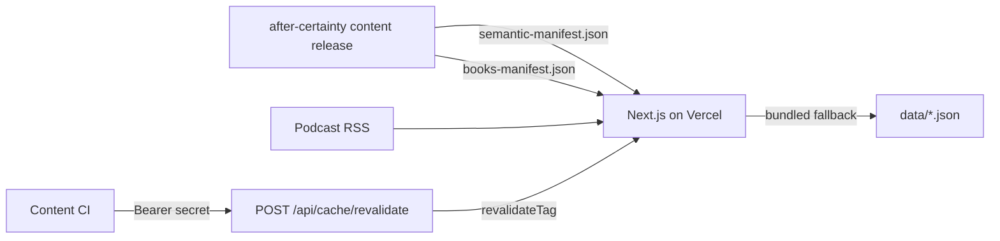
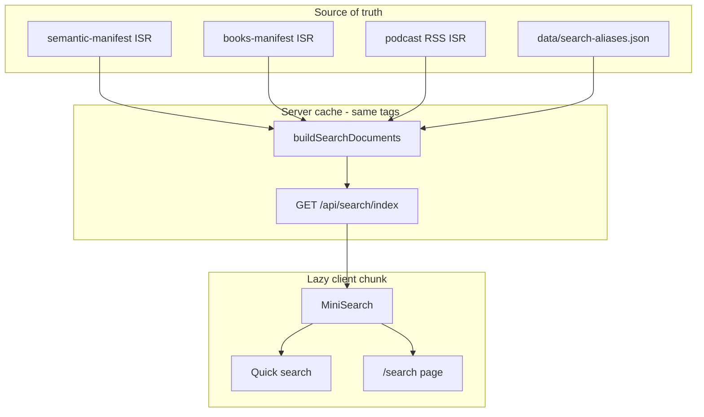

# Global Search — Technical and Product Plan

**Status:** Planning only (not implemented)  
**Repository:** `after-certainty-site`  
**Date:** 2026-07-19  
**Location:** `docs/roadmaps/global-search-plan.md` (chosen because the repo’s only existing doc under `docs/` is `security-assessment.md`; there is no prior roadmaps folder. This path matches the request and keeps architectural plans discoverable alongside security assessment notes.)

---

## 1. Executive summary

After Certainty is a Next.js App Router site on Vercel that surfaces an intellectual commons from ISR-fetched JSON manifests (semantic graph, books catalog, podcast RSS). Visitors already browse by entity type and explore relationships in the Observatory, but there is no site-wide way to ask an ordinary question or type a phrase and land in the right place.

**Global Search V1** should make that intellectual structure discoverable without becoming a generative assistant. The recommended architecture is:

- **Client-side MiniSearch** for query execution in the browser
- A **server-generated, cache-tagged JSON document index** built from the same loaders Explore already uses (plus a small authored alias file)
- Two UX surfaces sharing one index and ranking pipeline: a **quick-search palette** and a dedicated **`/search`** page
- **Metadata-oriented indexing** across books, concepts, patterns, thinkers, sources, and podcast episodes — **not** full manuscript text

This preserves the site’s low-backend model, avoids privileged client keys, and keeps the search corpus aligned with the existing ISR source of truth.

---

## 2. Current-state architecture

### 2.1 Application architecture

| Concern          | Current state                                                                                                                      |
| ---------------- | ---------------------------------------------------------------------------------------------------------------------------------- |
| Framework        | Next.js **16.2.10** (App Router only; no `pages/`)                                                                                 |
| UI               | React **19.2.7**, TypeScript, Tailwind CSS v4, MDX via `@next/mdx`                                                                 |
| Rendering        | Hybrid: RSC pages by default; CSR islands for Observatory, theme, consent, explore index search; ISR via `fetch` + `revalidateTag` |
| Hosting          | Vercel; no `vercel.json`; config in `next.config.ts`                                                                               |
| Backend          | No database, auth, or Server Actions. Route handlers: `POST /api/cache/revalidate`, JSON-LD GETs, `/feed.xml` redirect             |
| State            | Server loaders + React `cache()`; URL `searchParams` for browse/observatory; Zustand only for Observatory UI                       |
| Search libraries | **None** (no MiniSearch, Fuse, FlexSearch, Algolia, cmdk, Pagefind, etc.)                                                          |
| Analytics        | Consent-gated GA4 (`lib/analytics/events.ts`, `track.ts`) + Vercel Analytics / Speed Insights                                      |

Primary routes live under `app/`. Explore browse indexes sit in `app/explore/(browse)/`. Site chrome is `components/layout/site-shell.tsx` → `site-header.tsx` / `mobile-nav.tsx` / `site-footer.tsx`.

### 2.2 Content pipeline and hosting model



- Semantic graph: `lib/graph/manifest.ts` → GitHub release `latest/semantic-manifest.json`, cache tag `semantic-graph`, default revalidate 3600s; fallback `data/semantic-manifest.json`.
- Books catalog: `lib/books/manifest.ts` → `books-manifest.json`, cache tag `books-catalog`; fallback `data/books-manifest.json`.
- Podcast: `lib/podcast/rss.ts` → Anchor RSS; fallback `data/podcast-episodes.json`.
- Explore merge: `lib/explore/exploreSemanticGraph.ts` + `mergeCatalogBooksIntoSemanticGraph.ts`.

### 2.3 Existing discovery and search primitives

- **Type-scoped browse search** on Concepts, Thinkers, Sources only (`?q=` + pagination): `lib/explore/explore-index-browse.ts` (case-insensitive substring on `searchText`) and `components/explore/explore-index-search.tsx` (combobox, 250ms debounce, keyboard nav).
- **Books and Patterns indexes** list all items with no text search.
- **Observatory** filters kinds, predicates, ontology lens, depth — graph visibility, not corpus search.
- **Start Here** (`/start`) is editorial pathways, not query-driven.
- **No command palette**, shared Dialog primitive, or header search entry today. Closest overlay pattern: `mobile-nav.tsx` (`role="dialog"`, Escape, scroll lock).

### 2.4 Relevant reusable building blocks

| Asset                    | Path                                           | Reuse for Global Search                                                    |
| ------------------------ | ---------------------------------------------- | -------------------------------------------------------------------------- |
| Explore index item shape | `lib/explore/explore-index-browse.ts`          | Pattern for id/label/href/searchText — extend, don’t reuse as final schema |
| Explore search UI a11y   | `components/explore/explore-index-search.tsx`  | Combobox / listbox / `aria-activedescendant`                               |
| Canonical URLs           | `lib/graph/explorePaths.ts`                    | `exploreHrefForNode`                                                       |
| Related content          | `lib/graph/relatedContent.ts`                  | Post-result exploration                                                    |
| Overlay a11y             | `components/layout/mobile-nav.tsx`             | Quick-search dialog                                                        |
| Analytics links          | `components/analytics/tracked-link.tsx`        | Result click tracking                                                      |
| Cache tags               | `lib/graph/manifest.ts`, books/podcast loaders | Keep index in sync with content                                            |

---

## 3. Searchable-content inventory

Bundled snapshot facts (offline manifests in `data/`, `manifestVersion: 2`, `generatedAt: 2026-07-07`):

| Entity               |                           Count | Source of truth                           | Authored vs generated | Stable id                    | Canonical URL                         | Full text at build?            | In typed site model?                    |
| -------------------- | ------------------------------: | ----------------------------------------- | --------------------- | ---------------------------- | ------------------------------------- | ------------------------------ | --------------------------------------- |
| Books                |   28 semantic (+ catalog merge) | Dual: semantic + books catalog            | Upstream-generated    | `book-*` or `catalog:{slug}` | `/explore/books/{slug}`               | No (summaries + download URLs) | Yes (status stripped from semantic Zod) |
| Concepts             |                             137 | `glossary[]` in semantic manifest         | Generated             | `concept-{slug}`             | `/explore/concepts/{slug}`            | Definitions + enrichment only  | Yes                                     |
| Patterns             |                              30 | `patterns[]`                              | Generated             | `pattern-{slug}`             | `/explore/patterns/{slug}`            | Pattern body fields only       | Yes                                     |
| Thinkers             |                             339 | `thinkers[]` (v2) or derived from sources | Generated / derived   | `thinker-{slug}`             | `/explore/thinkers/{slug}`            | Bio/summary only               | Yes                                     |
| Sources              |                             408 | `sources[]`                               | Generated             | `source-{…}`                 | `/explore/sources/{slug}`             | Citation/summary only          | Yes                                     |
| Relationships        |                             110 | `relationships[]`                         | Generated             | None (edge endpoints)        | Observatory deep links                | N/A                            | Yes                                     |
| Situations           |                               1 | `situations[]` in release JSON            | Generated             | `situation-*`                | `/explore/situations/{slug}`          | Summary/enrichment             | Yes (Phase F)                           |
| Podcast episodes     | 1 in fallback (live RSS varies) | RSS / fallback JSON                       | Authored on host      | Title-slug `id` (fragile)    | `/podcast` hub; episode URLs external | Description snippet            | Yes (`PodcastEpisode`)                  |
| Chapters             |                               0 | —                                         | —                     | —                            | —                                     | —                              | **Not present**                         |
| Essays (as type)     |                        0 routes | Appear as book titles / `OngoingWork`     | Mixed                 | —                            | —                                     | —                              | Not first-class                         |
| Series / collections |                               0 | Marketing / ongoing works only            | —                     | —                            | —                                     | —                              | Not first-class                         |

### 3.1 Per-type field reliability (V1 indexing relevance)

**Books (semantic typed `Book`)**  
Reliable: `id`, `slug`, `title`. Optional: `subtitle`, `summary`, `coverImage`, concept/pattern/source refs, export blocks, purchase links.  
**Gap:** Raw release JSON includes `status`, `authors`, `slugAliases`, `description`, companions — but `bookSchema` in `lib/graph/schemas.ts` strips them. Catalog (`types/content.ts`) retains `status`, `slugAliases`, `themes`, `tags`, `authors`. Search normalization **must** rejoin catalog fields.

**Concepts**  
Reliable: `id`, `slug`, `title`, `shortDefinition`. Often: long definition, related books, enrichment (`recognitionSignals`, `questions`, etc.). Sparse: `layer`, `semanticTone`.

**Patterns**  
Reliable: `id`, `slug`, `title`, `summary`. Usually: `setup`, `problem`, `forces`, `observation`, `example`. Optional media links.

**Thinkers**  
Reliable: `id`, `slug`, `name`, `type`, `works[]`. Usually: `summary`, `whyThisMatters`, `relatedBooks`. Sparse: concept/pattern links.

**Sources**  
Reliable: `id`, `slug`, `name`, `type`, creators, often `title`/`citation`/`summary`. Optional year/publisher. Schema allows `url` / `whyThisMatters` but they are empty in the bundled snapshot.

**Podcast**  
`title`, `description`, `publishedAt`, `audioUrl`, `episodeUrl`. No on-site detail route; sitemap does not include episode deep links.

### 3.2 Lifecycle, editions, duplicates

- **Publication status** lives on the catalog (`published` \| `forthcoming` \| `draft` \| `in_progress` \| `collaborative`). Bundled catalog rows are forthcoming/draft; semantic raw books are marked published then stripped.
- **Editions:** e.g. `when-others-look-to-you-v1` / `v2` remain separate nodes; public alias `when-others-look-to-you` resolves via catalog helpers (`lib/books/generated-manifest.ts`).
- **Deduping:** slug collision helpers prefer stronger export/published rows; graph index last-write-wins with dev warnings.
- **Inconsistency risk (high):** semantic vs catalog titles/covers/exports can diverge; Zod stripping hides status/aliases from typed graph; bundled vs remote ISR can differ; podcast ids are title-derived.

### 3.3 What Global Search should differ from

| Existing experience          | Role                          | Global Search difference                              |
| ---------------------------- | ----------------------------- | ----------------------------------------------------- |
| Explore index `?q=`          | Filter one type list in place | Cross-type discovery + navigation away                |
| Observatory filters          | Neighborhood visibility       | Find entities by language, then optionally open graph |
| Start Here                   | Guided editorial paths        | Query-driven entry                                    |
| Adjacent nav / related grids | Post-arrival trails           | Entry point into those trails                         |

---

## 4. Product experience proposal

### 4.1 Surfaces

Global Search should ship as **two related surfaces sharing one system** (confirmed fit: the site already uses URL-driven browse search and needs a sitewide entry the header lacks).

#### Quick search

- Persistent control in the site header (desktop) and mobile nav / header icon
- Keyboard: `Cmd/Ctrl+K`; `/` when focus is not in an editable field
- Compact overlay/palette (full-screen on mobile)
- Known-item lookup, top ~8 results, keyboard operation
- Affordance to open full results (`/search?q=…`)
- Recent searches in `localStorage` (no accounts)

#### Full search results (`/search`)

- Shareable URL: `q` required for results; optional `type` filter (multi or single); preserve back/forward
- Grouped or filterable by entity type
- Relevance explanations (human labels, not raw scores)
- Suggested canonical terms / related concepts when aliases fire
- Pagination or “load more” if result sets are large (likely optional at current corpus size)
- Empty, loading, no-result, and error states

### 4.2 Interaction model

| Topic                        | V1 choice                                                                                           |
| ---------------------------- | --------------------------------------------------------------------------------------------------- |
| Search-as-you-type vs submit | Search-as-you-type with **250ms debounce** (match explore index); explicit submit still updates URL |
| Header vs full page          | Same index, ranking, and document model                                                             |
| Query in URL                 | Yes on `/search`; quick search may defer URL updates until “View all” or Enter-to-full-page         |
| Shareable results            | Yes via `/search?q=&type=`                                                                          |
| Recent searches              | localStorage, capped list, clearable, never synced to server                                        |
| Mobile                       | Full-screen dialog; large touch targets; no hover-only actions                                      |

### 4.3 States

- **Empty (no query):** short orientation copy (“Search books, concepts, patterns, thinkers, sources, and episodes”), optional Start Here / featured entry points (not a dashboard of stats).
- **Loading:** index fetch / MiniSearch init skeleton; do not block the whole site shell.
- **No results:** honest message + suggest fewer words, type filter clear, link to Explore / Start Here; surface “did you mean” only from alias dictionary hits.
- **Error:** index failed to load — retry control; fall back to type browse links.

---

## 5. Recommended V1 scope

**In scope**

1. Normalized search documents for: **book, concept, pattern, thinker, source, podcast_episode**
2. ISR-aligned index payload served to the client
3. MiniSearch client querying with field boosts, prefix, light fuzzy
4. `/search` full results page with type filters and relevance explanations
5. Quick search palette + keyboard shortcut (can ship immediately after `/search` MVP)
6. Authored alias / vocabulary bridge file
7. Privacy-conscious analytics events
8. Accessibility, performance budgets, and ranking fixtures

**Content indexed in V1 (metadata-oriented)**

- Titles, subtitles, short descriptions/summaries/definitions
- Pattern summary + setup + problem (high-signal thematic text)
- Thinker name/summary; source title/citation/creators
- Podcast title/description
- Catalog status, slug aliases, curated search aliases
- Resolved related entity **titles** (for bridging), not full related bodies

---

## 6. Explicit non-goals (V1)

- Generative AI answers or chat
- Full manuscript / EPUB / PDF / DOCX full-text indexing
- Chapter entities (do not exist in this repo)
- Situations as results (until typed into the schema)
- Relationship edges as primary result rows
- User accounts, saved libraries, or personalized ranking by identity
- Hosted search vendors (Algolia, Typesense, Elasticsearch, Meilisearch, etc.)
- Embedding/semantic vector retrieval (evaluate later)
- Replacing Observatory or type indexes
- Logging full raw query strings to third parties by default

---

## 7. Normalized search-document model

Derived from the actual content model (not a generic wishlist).

```ts
type SearchEntityType = "book" | "concept" | "pattern" | "thinker" | "source" | "podcast_episode";

type SearchVisibility = "listed" | "unlisted";

type SearchDocument = {
  /** Graph or synthetic stable id (e.g. concept-certainty, catalog:slug, podcast:episode-id) */
  id: string;
  entityType: SearchEntityType;
  slug: string;
  title: string;
  subtitle?: string;
  description?: string;
  /** Human type label for UI: "Concept", "Book", … */
  resultLabel: string;
  canonicalUrl: string;
  /** True when canonicalUrl is off-site (podcast episodes). */
  external?: boolean;
  image?: string;

  status?: "published" | "forthcoming" | "draft" | "in_progress" | "collaborative";
  edition?: string; // e.g. "v1", "v2"
  visibility: SearchVisibility;

  /** Concatenated match corpus for the engine */
  searchText: string;
  aliases: string[];
  themes?: string[];
  creatorNames?: string[];
  /** Resolved titles of related entities for matching + explanations */
  relatedTitles?: string[];

  conceptIds?: string[];
  patternIds?: string[];
  bookIds?: string[];

  publicationDate?: string;
  updatedDate?: string;

  boostWeight: number;
  relationshipDensity?: number;

  sourceArtifact: "semantic" | "catalog" | "podcast" | "aliases";
};
```

### 7.1 Field roles

| Role              | Fields                                                                                                                                                               |
| ----------------- | -------------------------------------------------------------------------------------------------------------------------------------------------------------------- |
| **Displayed**     | `resultLabel`, `title`, `subtitle`, `description` (truncated), `image`, `status`/`edition` badges, external indicator, relevance explanation (computed)              |
| **Match only**    | `searchText`, `aliases`, `themes`, `creatorNames`, `relatedTitles`, slug tokens                                                                                      |
| **Ranking**       | Exact/prefix title & alias hits, field weights, `boostWeight`, `status`, canonical-edition flags, `relationshipDensity` (secondary)                                  |
| **Filtering**     | `entityType`, `status` (optional later)                                                                                                                              |
| **Never indexed** | Download binary URLs as content, purchase affiliate noise, private secrets, raw HTML from RSS without sanitization, full manuscript bodies, internal `bookDir` paths |

### 7.2 Identity, editions, duplicates, URL stability

- **Stable key:** semantic/graph `id` preferred; podcast uses `podcast:{episode.id}`; catalog-only books use existing `catalog:{slug}` convention.
- **URLs:** always slug-based explore paths from `explorePaths`; if titles change, ids/slugs remain the contract. Alias redirects already exist for books — search should point at **canonical** slug URLs.
- **Editions:** separate documents for v1/v2; never silently merge. Rank current/public-alias target higher; demote superseded; show “Edition” in explanation.
- **Upcoming / draft:** include explore-addressable items with status badge; lower `boostWeight` for `draft` / `in_progress`; `forthcoming` below `published` but above draft. (Product judgment — see Decision Record.)
- **Duplicates:** document builder runs after explore merge + existing dedupe helpers; one document per surviving id.

### 7.3 Relevance explanation (computed at query time)

Do not show raw scores. Emit labels from match metadata, e.g.:

- “Title match”
- “Also known as …” (alias)
- “Central concept in N books” (from `relatedBooks` / book concept refs)
- “Thinker cited in N works”
- “Pattern summary discusses …”
- “Related to {concept titles}”
- “Forthcoming” / “Earlier edition”

Only claim explanations supportable from current metadata.

---

## 8. Architecture options and tradeoff table

| Option                                                           | Quality (exact / fuzzy / thematic)                                           | Index size & page weight           | Build / runtime complexity | Ops / cost / vendor      | Security / privacy       | Fit for this repo                                |
| ---------------------------------------------------------------- | ---------------------------------------------------------------------------- | ---------------------------------- | -------------------------- | ------------------------ | ------------------------ | ------------------------------------------------ |
| **1. Client JSON + substring** (extend explore browse)           | Exact/partial only; weak thematic; no typo tolerance                         | Small                              | Very low                   | None                     | Excellent                | Insufficient for product goal                    |
| **2. Client MiniSearch / FlexSearch / Fuse over generated docs** | Strong exact+prefix; light fuzzy; aliases via fields; thematic via summaries | ~140–200 KB gzip now               | Low–medium                 | None                     | Excellent                | **Best V1 fit**                                  |
| **3. Build-only static shards by type**                          | Same as (2) if engine same                                                   | Similar; easier code-split by type | Medium; **stale vs ISR**   | None                     | Excellent                | Weaker than ISR-coupled index                    |
| **4. Hosted search (Algolia et al.)**                            | Excellent tooling                                                            | Tiny client                        | Medium integration         | Cost + vendor + key mgmt | Key restriction required | Overkill; ops contrary to low-backend preference |
| **5. Self-hosted search service**                                | High                                                                         | N/A client                         | High                       | High ops                 | Network surface          | No existing infra                                |
| **6. Server/DB FTS**                                             | Good if Postgres exists                                                      | N/A                                | High                       | Needs DB                 | Server-side queries      | **No DB in repo**                                |
| **7. Embeddings later**                                          | Strong thematic                                                              | Large vectors / API                | High                       | Cost / provider          | Query privacy            | Phase F evaluation only                          |

### Notes on browser libraries

- **MiniSearch:** field boosts, prefix, fuzzy, small API — preferred.
- **FlexSearch:** very fast; ranking control more opaque.
- **Fuse.js:** fine for tiny lists; weaker structured multi-field ranking at ~1k docs with boosts.

---

## 9. Recommended architecture

### 9.1 V1 design



1. **`buildSearchDocuments()`** (server): read `getExploreSemanticGraph()`, catalog for status/aliases/themes, podcast episodes, alias file → `SearchDocument[]`.
2. **`GET /api/search/index`**: returns JSON (documents or pre-serialized MiniSearch index) with caching tied to existing revalidate tags (`semantic-graph`, `books-catalog`, `podcast-rss` as applicable). Offline/CI uses bundled manifests like the rest of the site.
3. **Client**: lazy-load search module on first open of quick search or `/search`; init MiniSearch; query locally.
4. **No privileged secrets** in the index or client bundle.

### 9.2 Why this is best here

- Corpus ~943 documents; measured lean JSON **~138–150 KB gzip** — comfortable for lazy load on mobile.
- Content already moves via ISR; a deploy-frozen build artifact would drift until the next deploy, becoming a second source of truth.
- No search vendor, DB, or auth required.
- MiniSearch covers exact lookup + enough fuzzy/alias bridging for V1.
- Matches “prefer simplest architecture” and “avoid persistent backend unless justified.”

### 9.3 Migration threshold

Revisit hosted or server-side search when **any** of these hold:

- Compressed transferable index sustainably **> ~1.5–2 MB**
- Product requires **full chapter / transcript** indexing
- Need server-side aggregation of unresolved queries at volume
- Client query latency on mid-range mobile exceeds budget after optimization

Soft alert budget: **500 KB gzip**. Hard review: **1.5–2 MB gzip**.

---

## 10. Relevance and ranking strategy

### 10.1 Query classes

| Query class     | Example                          | Primary signals                                                    |
| --------------- | -------------------------------- | ------------------------------------------------------------------ |
| Exact title     | “Trust Beyond Similarity”        | Title exact > alias exact                                          |
| Partial title   | “look to you”                    | Title prefix/phrase                                                |
| Person          | “Rebecca Solnit”, “Simone Biles” | Thinker/source creator fields                                      |
| Concept name    | “moral licensing”, “certainty”   | Concept title/alias                                                |
| Pattern phrase  | “Exceptions Are Forever”         | Pattern title/summary                                              |
| Source / author | “John Dewey”                     | Thinker + sources by creator                                       |
| Thematic NL     | “Why does collaboration fail?”   | Summary/definition + aliases + related titles                      |
| Quoted phrase   | `"scoreboard"`                   | Phrase boost in searchText                                         |
| Misspelling     | “acountability”                  | MiniSearch fuzzy (bounded)                                         |
| Broad term      | “trust”                          | Prefer concepts/patterns/books over long-tail sources unless exact |

### 10.2 Ranking signals (ordered philosophy)

1. Exact title match
2. Exact alias match (`kind: alias`)
3. Prefix title / alias
4. Subtitle / short definition / summary
5. Pattern setup/problem
6. Related entity titles / creators
7. Broader searchText
8. **Entity-type weights** (tunable): concept ≈ pattern ≈ book > thinker > podcast > source (sources are numerous; demote unless strong lexical match)
9. **Status:** published > forthcoming > draft/in_progress
10. **Edition:** canonical/public-alias target > superseded
11. Editorial boost (`boostWeight`) for Start Here shelf / featured — used sparingly
12. Relationship density — weak tie-breaker only

**Do not** let popularity or click-through alone define intellectual relevance in V1.

### 10.3 Reliable explanations from current metadata

| Explanation             | Reliable now?                                     |
| ----------------------- | ------------------------------------------------- |
| Title / alias match     | Yes                                               |
| “Definition mentions …” | Yes (concepts)                                    |
| “Appears in N books”    | Yes when `relatedBooks` / book.concept refs exist |
| “Thinker with N works”  | Yes (`works.length`)                              |
| “Chapter discusses …”   | **No** (no chapters)                              |
| “Transcript …”          | **No**                                            |
| Silent synonym collapse | **Forbidden** — use `related` labeling            |

---

## 11. Alias and vocabulary-bridging strategy

Global Search must bridge everyday language to canonical terms **without erasing distinctions**.

### 11.1 Layers (combination)

| Layer                  | Location                                       | Use                                                                  |
| ---------------------- | ---------------------------------------------- | -------------------------------------------------------------------- |
| Authored search config | `data/search-aliases.json` (new)               | Everyday phrases, misspellings, acronyms, pattern paraphrases        |
| Catalog aliases        | `slugAliases` on books                         | Former slugs / public aliases                                        |
| Entity text            | titles, subtitles, summaries                   | Natural language already present                                     |
| Semantic relationships | `relationships[]` + related\* arrays           | Suggest related concepts after a hit — not silent synonyms           |
| Upstream (future)      | content-repo alias fields on concepts/patterns | Prefer when available; site file remains for search-only paraphrases |

### 11.2 Alias record shape (proposed)

```json
{
  "version": 1,
  "entries": [
    {
      "terms": ["temporary rules", "temporary exceptions becoming permanent"],
      "kind": "related",
      "targetIds": ["pattern-exceptions-are-forever"],
      "note": "Related pattern; not a literal synonym"
    },
    {
      "terms": ["wolty"],
      "kind": "alias",
      "targetIds": ["book-when-others-look-to-you-v1"]
    }
  ]
}
```

- `kind: "alias"` — interchangeable for lookup (names, slug history, acronyms).
- `kind: "related"` — boost/suggest targets; UI says “Related to …”, never “Also called …”.

### 11.3 Examples mapped to strategy

| Visitor language                                    | Bridge                                               | Caution                              |
| --------------------------------------------------- | ---------------------------------------------------- | ------------------------------------ |
| “temporary rules”                                   | related → Exceptions Are Forever (+ situation later) | Not a synonym claim                  |
| “bad news not reaching leadership”                  | related → information-flow patterns                  | May need authored entry              |
| “being sincere but wrong”                           | related → sincerity / credibility concepts           | Multi-target related                 |
| “scoreboard” / “score doesn’t tell the whole story” | alias/related → scoreboard remainder concepts        | Prefer concept ids when known        |
| “trusting people who disagree”                      | related → Trust Beyond Similarity                    | Book/concept title match may suffice |
| “Simone Biles” / “Rebecca Solnit”                   | thinker/source creator exact                         | Standard name fields                 |

Singular/plural and light stemming: rely on MiniSearch tokenize + alias plurals where needed; do not over-stem technical terms.

---

## 12. Accessibility requirements

| Requirement    | Concrete expectation                                                                                                       |
| -------------- | -------------------------------------------------------------------------------------------------------------------------- |
| Keyboard       | Open (Cmd/Ctrl+K, `/`), move results, Enter select, Escape close, Tab not trapped incorrectly                              |
| Focus          | Move focus into dialog on open; restore to trigger on close; focus trap in modal                                           |
| Screen readers | `role="dialog"` + `aria-modal` for quick search; `role="search"`; listbox/option or list with live region for result count |
| Grouping       | Headings or `role="group"` per entity type on full page                                                                    |
| Labels         | Visible label or `aria-label` on search input; external results announce “opens in new site/tab”                           |
| Active option  | `aria-activedescendant` or roving tabindex (match explore search patterns)                                                 |
| Contrast       | Use existing design tokens; verify result meta text                                                                        |
| Touch          | ≥ 44px targets for open control and result rows on mobile                                                                  |
| Reduced motion | Honor `prefers-reduced-motion` for palette enter/exit                                                                      |
| Escape         | Closes palette; clears suggestion list without navigating away on full page                                                |

Reuse patterns from `mobile-nav.tsx` and `explore-index-search.tsx`; add proper focus trap for the palette (stronger than cookie banner).

---

## 13. Performance budget

| Budget                              | Target                                                                                                      |
| ----------------------------------- | ----------------------------------------------------------------------------------------------------------- |
| Compressed index transfer (V1 lean) | **~140–200 KB gzip** at current corpus                                                                      |
| Alert threshold                     | **500 KB gzip**                                                                                             |
| Migration review                    | **1.5–2 MB gzip**                                                                                           |
| Initial homepage JS                 | Search code **not** in critical path — dynamic `import()` on first open / `/search`                         |
| Debounce                            | 250ms                                                                                                       |
| Mid-range mobile                    | Index parse + MiniSearch init < ~200ms after download on modern mid-tier; query < 50ms for corpus < 5k docs |
| Result sets                         | Cap quick search at 8; full page page size 20–24 (align with explore)                                       |
| Caching                             | HTTP cache + Next cache tags; CDN-friendly GET                                                              |
| Build cost                          | Document build should be O(entities); fail CI if gzip budget exceeded                                       |

Compression: standard gzip/brotli from Vercel for JSON responses. Prefer serving a compact document array and building MiniSearch on the client **or** a serialized index — choose based on init-time benchmarks in Phase B; both stay within budget at current size.

---

## 14. Security considerations

| Topic         | Requirement                                                                                                                  |
| ------------- | ---------------------------------------------------------------------------------------------------------------------------- |
| Credentials   | No privileged API keys in client code; search index is public data only                                                      |
| XSS           | Treat titles/descriptions as text; React escaping; sanitize any HTML from RSS (`lib/podcast` already strips) before indexing |
| Highlights    | Safe highlighter (no `dangerouslySetInnerHTML` with query-controlled HTML)                                                   |
| External URLs | `rel="noopener noreferrer"`; clear external labeling for podcast episodes                                                    |
| Provider keys | N/A in V1                                                                                                                    |
| Dependencies  | Add MiniSearch via normal review; Dependabot + `npm audit` in CI                                                             |
| Rate limiting | Optional light rate limit on `/api/search/index` only if abuse appears; index is not secret                                  |
| Supply chain  | Prefer well-maintained MiniSearch; pin version in lockfile                                                                   |

Align with trust model in `docs/security-assessment.md`: browser is untrusted; manifests are public.

---

## 15. Analytics and success measures

### 15.1 Events (consent-gated, production only — extend `lib/analytics/events.ts`)

| Event               | Params (minimal)                                                                            | Notes                                       |
| ------------------- | ------------------------------------------------------------------------------------------- | ------------------------------------------- |
| `search_open`       | `method`: header \| shortcut \| mobile                                                      | No query                                    |
| `search_query`      | `surface`: quick \| full; `has_results`: bool; `result_count_bucket`; `query_length_bucket` | **Do not** send raw query by default        |
| `search_select`     | `content_type`, `item_id`, `surface`, `rank_bucket`                                         | Reuse `select_content` shape where possible |
| `search_refine`     | `surface`                                                                                   | Filter/type change                          |
| `search_no_results` | `surface`, `query_length_bucket`                                                            |                                             |
| `search_expand`     | —                                                                                           | Quick → full                                |

**Privacy:** Prefer buckets over raw strings. If product later needs unresolved-query review, use a **separate, retention-limited, access-controlled** mechanism (e.g. sampled server log or first-party store) — not GA raw queries. Document retention if enabled.

### 15.2 Product metrics

- Search → result click rate
- No-result rate
- Query refinement rate
- Time to first useful click (client timing, privacy-safe)
- % sessions with a second meaningful page after search
- Most common unresolved searches (via controlled review channel)
- Queries that fan out to many destinations (discovery breadth)

### 15.3 Feedback into the commons

Unresolved searches inform: new aliases, better descriptions, curated Start Here trails, missing concepts/patterns, nav changes, concept-model gaps — not automatic synonym collapse.

---

## 16. Testing strategy

### 16.1 Layers

| Layer             | What                                                                                                                  |
| ----------------- | --------------------------------------------------------------------------------------------------------------------- |
| Unit              | Normalization, alias merge, visibility/status, edition boosts, URL generation, duplicate detection, index size helper |
| Ranking fixtures  | Frozen document set + query → expected top ids                                                                        |
| Alias / synonym   | `alias` vs `related` behavior                                                                                         |
| Canonical edition | WoLTY alias / v1 / v2 ranking                                                                                         |
| A11y              | Testing Library + axe or established project patterns; keyboard flows                                                 |
| URL state         | `q` / `type` parse and back-forward                                                                                   |
| E2E (Playwright)  | Open palette, search known title, land on entity; mobile viewport                                                     |
| Build consistency | CI fails if document ids missing URLs or gzip > budget                                                                |
| Security          | Highlight/snippet tests reject HTML injection                                                                         |

### 16.2 Search-quality fixture (≥ 20 queries)

Expected tops use **acceptable sets** where ambiguity is real. IDs below are illustrative of intent; Phase B should bind them to real manifest ids in tests.

| #   | Query                                     | Class                   | Expected top / acceptable set                                               |
| --- | ----------------------------------------- | ----------------------- | --------------------------------------------------------------------------- |
| 1   | `certainty`                               | Exact concept           | Concept Certainty                                                           |
| 2   | `Trust Beyond Similarity`                 | Exact book/title        | Matching book doc                                                           |
| 3   | `When Others Look to You`                 | Edition ambiguity       | Canonical/public edition first; v2 present lower                            |
| 4   | `when-others-look-to-you`                 | Slug alias              | Canonical book URL target                                                   |
| 5   | `Exceptions Are Forever`                  | Pattern title           | That pattern                                                                |
| 6   | `Rebecca Solnit`                          | Person                  | Thinker and/or sources by her                                               |
| 7   | `Simone Biles`                            | Person                  | Matching thinker/source if present; else honest no-result                   |
| 8   | `John Dewey`                              | Person                  | Thinker Dewey                                                               |
| 9   | `moral licensing`                         | Concept phrase          | Concept if present; else related concept set                                |
| 10  | `scoreboard`                              | Broad/concept           | Scoreboard-related concept(s)                                               |
| 11  | `accountability`                          | Thematic                | Concepts/patterns/books with accountability in summary — not random sources |
| 12  | `temporary exceptions becoming permanent` | NL / related            | Pattern Exceptions Are Forever and/or situation once typed                  |
| 13  | `Why does collaboration fail?`            | NL question             | Patterns/concepts on collaboration/failure — alias-assisted                 |
| 14  | `trust and disagreement`                  | Thematic                | Trust Beyond Similarity + trust/disagreement concepts                       |
| 15  | `Which books discuss authority?`          | NL + type intent        | Books with authority in summary/concepts; type bias to books                |
| 16  | `acountability`                           | Misspelling             | Same family as accountability (fuzzy)                                       |
| 17  | `wolty`                                   | Acronym alias           | WoLTY book (via alias file)                                                 |
| 18  | `observer patterns`                       | Partial / draft title   | Matching book if listed; status badge                                       |
| 19  | `xyzzy-no-such-term-12345`                | No result               | Empty set                                                                   |
| 20  | `Dewey`                                   | Partial person          | Thinker John Dewey                                                          |
| 21  | podcast episode title from feed           | Exact episode           | Podcast episode (external)                                                  |
| 22  | `structural tension`                      | Relationship vocabulary | Concepts linked by that predicate / ontology — not a fake synonym           |

---

## 17. Phased implementation plan

### Phase A — Discovery and content normalization

|                  |                                                                                                                                                                                          |
| ---------------- | ---------------------------------------------------------------------------------------------------------------------------------------------------------------------------------------- |
| **Goal**         | Single `SearchDocument[]` builder from explore graph + catalog status/aliases + podcast; visibility rules; no second source of truth                                                     |
| **Code areas**   | `lib/search/buildSearchDocuments.ts` (new), `lib/explore/mergeCatalogBooksIntoSemanticGraph.ts`, possibly pass-through of status in search layer without breaking Zod public `Book` type |
| **Artifacts**    | None generated yet; unit fixtures from bundled manifests                                                                                                                                 |
| **Dependencies** | None new                                                                                                                                                                                 |
| **Acceptance**   | Every listed explore entity with a URL produces one document; editions distinct; catalog status available on book docs; deterministic ids                                                |
| **Tests**        | Normalization, dedupe, URL, status merge                                                                                                                                                 |
| **Risks**        | Dual manifests disagree — document builder must define precedence (semantic id/title, catalog status/aliases)                                                                            |
| **Effort**       | Medium                                                                                                                                                                                   |
| **Prior phases** | None                                                                                                                                                                                     |
| **Ships alone?** | No (library only)                                                                                                                                                                        |

### Phase B — Search index generation

|                  |                                                                                                                               |
| ---------------- | ----------------------------------------------------------------------------------------------------------------------------- |
| **Goal**         | Cached index endpoint + MiniSearch wiring + size budget + ranking fixtures                                                    |
| **Code areas**   | `app/api/search/index/route.ts`, `lib/search/miniSearch.ts`, `data/search-aliases.json`, package.json dependency `minisearch` |
| **Artifacts**    | Runtime JSON index (not a divergent checked-in corpus dump)                                                                   |
| **Dependencies** | `minisearch`                                                                                                                  |
| **Acceptance**   | GET index returns docs; gzip ≤ alert budget; fixture queries 1–22 meet ranking expectations for shipped aliases               |
| **Tests**        | Ranking fixtures, budget test, alias kind tests                                                                               |
| **Risks**        | Over-indexing enrichment blows budget                                                                                         |
| **Effort**       | Medium                                                                                                                        |
| **Prior**        | A                                                                                                                             |
| **Ships alone?** | No                                                                                                                            |

### Phase C — Dedicated `/search` page (MVP ship)

|                  |                                                                                                     |
| ---------------- | --------------------------------------------------------------------------------------------------- |
| **Goal**         | Full results UX, filters, states, a11y, analytics, shareable URLs                                   |
| **Code areas**   | `app/search/page.tsx`, `components/search/*`, `lib/analytics/events.ts`, sitemap optional `/search` |
| **Acceptance**   | Shareable `/search?q=`; type filter; keyboard list; no-result/error; consent-safe events            |
| **Tests**        | URL state, a11y, e2e known-title → entity                                                           |
| **Risks**        | Scope creep into Observatory redesign                                                               |
| **Effort**       | Medium–Large                                                                                        |
| **Prior**        | A, B                                                                                                |
| **Ships alone?** | **Yes — smallest product MVP**                                                                      |

### Phase D — Quick search

|                  |                                                                             |
| ---------------- | --------------------------------------------------------------------------- |
| **Goal**         | Header entry, shortcuts, top results, recent searches, link to full page    |
| **Code areas**   | `site-header.tsx`, `mobile-nav.tsx`, `components/search/quick-search*.tsx`  |
| **Acceptance**   | Cmd/Ctrl+K; mobile full-screen; focus restore; recent queries local-only    |
| **Tests**        | Keyboard e2e, focus management                                              |
| **Risks**        | Shortcut conflicts with browser `/` find — only bind `/` when not in inputs |
| **Effort**       | Medium                                                                      |
| **Prior**        | C                                                                           |
| **Ships alone?** | Yes after C                                                                 |

### Phase E — Quality refinement

|                  |                                                                                                                                               |
| ---------------- | --------------------------------------------------------------------------------------------------------------------------------------------- |
| **Goal**         | Grow aliases, tune ranking, better snippets, unresolved-query workflow, optional capped enrichment text                                       |
| **Code areas**   | `data/search-aliases.json`, ranking weights, `lib/search/snippets.ts`, `lib/search/enrichment.ts`, `docs/roadmaps/search-quality-workflow.md` |
| **Acceptance**   | Thematic fixture queries improve; no silent synonym abuse                                                                                     |
| **Effort**       | Medium                                                                                                                                        |
| **Prior**        | C (D optional)                                                                                                                                |
| **Ships alone?** | Yes                                                                                                                                           |
| **Workflow**     | See `docs/roadmaps/search-quality-workflow.md` for privacy-safe unresolved-query review and alias promotion                                   |

### Phase F — Expanded corpus

|                  |                                                                                                                      |
| ---------------- | -------------------------------------------------------------------------------------------------------------------- |
| **Goal**         | Situations (schema + UI), chapter summaries if upstream adds them, essays/transcripts carefully, evaluate embeddings |
| **Code areas**   | `lib/graph/schemas.ts`, explore situations routes, search `situation` type, embeddings eval doc                      |
| **Risks**        | Payload size, copyright for external source text, duplicate editions                                                 |
| **Effort**       | Large                                                                                                                |
| **Prior**        | E recommended                                                                                                        |
| **Ships alone?** | Yes (incremental)                                                                                                    |
| **This slice**   | Typed situations + explore/search; chapters/transcripts deferred (absent upstream); embeddings eval documented       |
| **Eval**         | See `docs/roadmaps/search-embeddings-evaluation.md`                                                                  |

---

## 18. File-by-file change map

### This planning change

| File                                  | Action                  |
| ------------------------------------- | ----------------------- |
| `docs/roadmaps/global-search-plan.md` | **Add** (this document) |

### Later implementation (not in this change)

| File                                         | Action                                                                 |
| -------------------------------------------- | ---------------------------------------------------------------------- |
| `lib/search/types.ts`                        | Add `SearchDocument` types                                             |
| `lib/search/buildSearchDocuments.ts`         | Normalize corpus                                                       |
| `lib/search/aliases.ts`                      | Load/merge `data/search-aliases.json`                                  |
| `lib/search/ranking.ts`                      | Boosts + explanation helpers                                           |
| `lib/search/miniSearch.ts`                   | Client/server index helpers                                            |
| `lib/search/budget.ts`                       | Size guards                                                            |
| `data/search-aliases.json`                   | Authored vocabulary bridge                                             |
| `app/api/search/index/route.ts`              | Cached index GET                                                       |
| `app/search/page.tsx`                        | Full results route                                                     |
| `components/search/search-page.tsx`          | Results UI                                                             |
| `components/search/quick-search-dialog.tsx`  | Palette                                                                |
| `components/search/search-result-item.tsx`   | Row + explanation                                                      |
| `components/layout/site-header.tsx`          | Search trigger                                                         |
| `components/layout/mobile-nav.tsx`           | Mobile entry                                                           |
| `lib/analytics/events.ts` / `track.ts`       | Search events                                                          |
| `package.json` / lockfile                    | Add `minisearch`                                                       |
| `lib/search/*.test.ts`, `e2e/search.spec.ts` | Tests                                                                  |
| Possibly `lib/graph/schemas.ts`              | Only if situations/status must be first-class beyond search-layer join |

**Reuse without rewrite:** `explorePaths`, `explore-index-search` a11y ideas, `TrackedLink`, manifest cache tags, podcast sanitization.

---

## 19. Risks and open questions

### Risks

| Risk                                              | Severity              | Mitigation                                                     |
| ------------------------------------------------- | --------------------- | -------------------------------------------------------------- |
| Dual book catalogs + Zod stripping status/aliases | **Highest technical** | Search-layer join to catalog; tests for WoLTY editions         |
| Metadata-only search misses thematic NL queries   | **Highest product**   | Alias file + pattern body fields; Phase E iteration            |
| Index treated as second corpus                    | High                  | Generate only from live loaders + aliases; revalidate together |
| Podcast id instability                            | Medium                | External results; tolerate churn; don’t over-rank              |
| Draft/forthcoming noise in results                | Medium                | Status badges + boost penalties                                |
| Alias over-equivalence                            | Medium                | `alias` vs `related` kinds; editorial review                   |

### Open questions (not fully answerable from the repository)

1. **Who maintains `data/search-aliases.json`?** Editorial owner vs engineering vs content-repo pipeline.
2. **Should `draft` catalog titles appear in search at all?** Recommendation: yes if they have explore URLs, with strong demotion; product may choose exclude.
3. **When will situations be added to the typed Zod schema upstream?** High value for queries like “temporary exceptions becoming permanent”.
4. **Should books/patterns browse indexes adopt the global engine later?** Likely yes, but out of V1 scope.

---

## 20. Future evolution

- Promote situations (and eventually pathways) into typed explore entities and search docs
- Chapter summaries from upstream without full manuscript bytes
- Podcast transcripts if legally/ practically available
- Optional embedding retrieval for thematic queries once metadata+aliases plateau
- Unify explore type-index search with MiniSearch for consistent behavior
- Hosted search only after migration thresholds in §9.3
- Still avoid generative “answers” as the primary search metaphor unless product strategy changes

---

## 21. Definition of done

### Done for this planning deliverable

- [x] Plan published at `docs/roadmaps/global-search-plan.md`
- [x] All required sections and decision record present
- [x] Recommendations grounded in repository facts
- [x] No feature implementation, dependency installs, or production code changes beyond this document

### Done for V1 implementation (Phases A–F slice)

- [x] Search documents built from explore loaders + catalog + podcast + aliases
- [x] Client MiniSearch over cached index; no privileged keys
- [x] `/search` shareable, filterable, accessible
- [x] Quick search + shortcuts (Phase D)
- [x] Ranking fixtures green; gzip under alert budget
- [x] Analytics events consent-gated without raw query logging by default
- [x] Manuscript full text still excluded
- [x] Phase E quality: aliases, snippets, capped enrichment, unresolved-query workflow doc
- [x] Phase F slice: typed situations in schema, explore UI, and search; embeddings evaluation documented
- [ ] Chapter summaries / transcripts (deferred — absent upstream)

---

## Decision record

| #   | Decision                                             | Answer                                                                                                                                                                                                                                                                                                                                                            |
| --- | ---------------------------------------------------- | ----------------------------------------------------------------------------------------------------------------------------------------------------------------------------------------------------------------------------------------------------------------------------------------------------------------------------------------------------------------- |
| 1   | Should search run entirely in the browser for V1?    | **Yes** — query execution in the browser via MiniSearch.                                                                                                                                                                                                                                                                                                          |
| 2   | Should the index be generated during the site build? | **ISR-coupled server generation**, not a deploy-only orphan file. Build/offline uses bundled manifests; production regenerates with the same cache tags as Explore.                                                                                                                                                                                               |
| 3   | Which content types belong in V1?                    | **book, concept, pattern, thinker, source, podcast_episode**.                                                                                                                                                                                                                                                                                                     |
| 4   | Should full manuscript text be excluded from V1?     | **Yes.**                                                                                                                                                                                                                                                                                                                                                          |
| 5   | How should canonical and superseded books be ranked? | **Separate documents**; boost published + public-alias/canonical edition; demote superseded; show edition labels.                                                                                                                                                                                                                                                 |
| 6   | Where should aliases be maintained?                  | **Combination:** `data/search-aliases.json` + catalog `slugAliases` + entity text; related≠alias.                                                                                                                                                                                                                                                                 |
| 7   | Shared index/ranking for quick search and full page? | **Yes.**                                                                                                                                                                                                                                                                                                                                                          |
| 8   | Expected compressed index size?                      | **~140–200 KB gzip** at current corpus; alert **500 KB**; review **1.5–2 MB**.                                                                                                                                                                                                                                                                                    |
| 9   | When migrate to hosted/server-side search?           | When size, full-text, or ops thresholds in §9.3 are crossed.                                                                                                                                                                                                                                                                                                      |
| 10  | Facts vs product judgments?                          | **Facts:** Next 16 / RSC+ISR / Vercel; manifests and counts; no search vendor; explore substring search; Zod stripping; measured gzip sizes; dual book catalogs; no chapters. **Judgments:** MiniSearch; `/search` before Cmd-K as MVP slice; include podcast in V1; defer situations; draft visibility with demotion; alias file in site repo; type boost order. |

---

## Appendix A — Current corpus size reference

Measured from bundled `data/` on 2026-07-19:

| Artifact                             |                                   Bytes |
| ------------------------------------ | --------------------------------------: |
| `semantic-manifest.json`             |                               1,444,622 |
| `books-manifest.json`                |                                   5,021 |
| Lean search documents JSON (approx.) | ~750 KB uncompressed / **~138 KB gzip** |
| Richer pattern/concept text variant  |                        **~149 KB gzip** |

Entity counts: 28 books, 137 concepts, 30 patterns, 408 sources, 339 thinkers, 110 relationships, 1 raw situation, 1 fallback podcast episode.

---

## Appendix B — Smallest independently shippable slice

**Phase C:** ship `/search` with the shared MiniSearch index and type filters, linked temporarily from Explore or footer if header palette (Phase D) is not ready. This delivers shareable discovery without blocking on shortcut UX.
