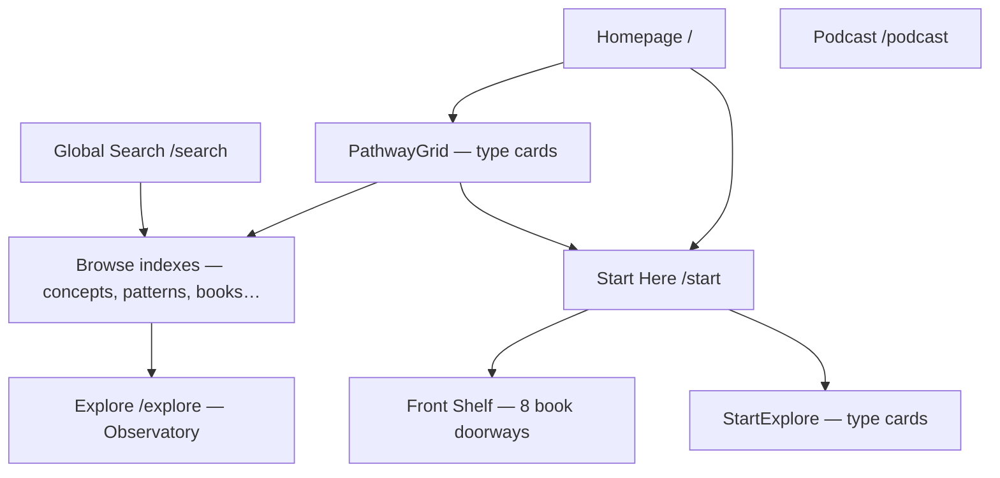
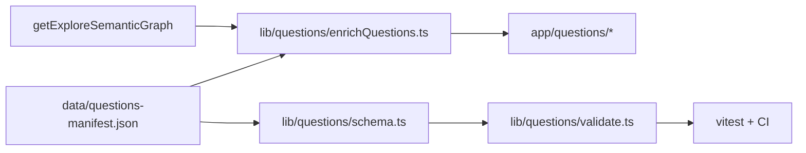

# Start with a Question — Product, Content, UX, and Technical Plan

**Deliverable path:** [`docs/roadmaps/start-with-a-question-plan.md`](docs/roadmaps/start-with-a-question-plan.md)  
**Location rationale:** The repo already stores product/architecture plans under [`docs/roadmaps/`](docs/roadmaps/) (e.g. [`global-search-plan.md`](docs/roadmaps/global-search-plan.md)). This keeps planning docs discoverable next to security notes in [`docs/security-assessment.md`](docs/security-assessment.md).

**Status:** Implemented (see feature branch)

---

## 1. Executive summary

After Certainty is a **Next.js 16 App Router** site (`package.json`: Next 16.2.10, React 19) deployed on **Vercel**, with **no database or auth**. Content flows from ISR-fetched **`semantic-manifest.json`** and **`books-manifest.json`** (GitHub release assets from `ksteffe/after-certainty`) plus podcast RSS, with bundled fallbacks in [`data/`](data/).

**Facts from repository:**

- Discovery today is **type-first** (Books, Explore/Observatory, Patterns, etc.) or **book-first** (Start Here Front Shelf in [`lib/start/front-shelf.ts`](lib/start/front-shelf.ts)).
- **Global Search is already shipped** ([`/search`](app/search/page.tsx), MiniSearch, [`data/search-aliases.json`](data/search-aliases.json)) — it complements but does not replace editorial entrances.
- **No chapter URLs, essay routes, or curated trail objects** exist; the only shipped reading-path product is Front Shelf (unordered book doorways).
- **Situations** exist but are sparse (1 bundled entry); **Pathway** type in [`types/observatory.ts`](types/observatory.ts) is explicitly “not wired in v1.”

**Product recommendation (judgment):** Add **Start with a Question** as a **coexisting editorial discovery mode** — a dedicated `/questions` index and permanent `/questions/[slug]` pages with finite, authored paths (3–7 stops) that resolve to canonical explore entities. Do **not** replace Start Here; **extend** it with a question-based section. Surface **3–4 featured questions** on the homepage and a prominent block on Start Here.

**Technical recommendation (judgment):** **Hybrid authored manifest + generated enrichment/validation** in this site repo (same pattern as [`data/search-aliases.json`](data/search-aliases.json) + [`lib/search/buildSearchDocuments.ts`](lib/search/buildSearchDocuments.ts)), not a separate CMS and not auto-generated paths from the graph.

**V1 launch scope:** **12 questions**, static path rendering, **no saved progress**, fiction allowed as framed stops, podcast as optional external stops.

---

## 2. Current discovery experience

### 2.1 Application architecture (facts)

| Concern   | State                                                                                                                                                                                                         |
| --------- | ------------------------------------------------------------------------------------------------------------------------------------------------------------------------------------------------------------- |
| Framework | Next.js 16 App Router, React 19, TypeScript, Tailwind v4                                                                                                                                                      |
| Rendering | RSC default; ISR via `fetch` + `revalidateTag` (3600s); React `cache()` dedup                                                                                                                                 |
| Backend   | Route handlers only: cache revalidate, search index API, JSON-LD, feed redirect                                                                                                                               |
| State     | Zustand (Observatory), URL params (browse/search), consent context                                                                                                                                            |
| Tests     | Vitest (~81 files), Playwright E2E ([`e2e/navigation.spec.ts`](e2e/navigation.spec.ts), [`e2e/search.spec.ts`](e2e/search.spec.ts), smoke URLs in [`e2e/fixtures/smoke-urls.ts`](e2e/fixtures/smoke-urls.ts)) |
| Analytics | Consent-gated GA4 ([`lib/analytics/events.ts`](lib/analytics/events.ts)) + Vercel Analytics                                                                                                                   |
| a11y      | Skip link, dialog patterns (mobile nav, search palette), `focus-visible:ring-accent`, fieldset legends for filters                                                                                            |

### 2.2 How visitors are oriented today



**Editorial paths:** Homepage hero CTA → Start Here; [`PathwayGrid`](components/home/pathway-grid.tsx); Start Here copy + [`FRONT_SHELF_ENTRIES`](lib/start/front-shelf.ts) (8 books with doorway labels).

**Generated paths:** Entity detail “related content” ([`lib/graph/relatedContent.ts`](lib/graph/relatedContent.ts)); graph neighborhood on concept pages; Observatory focus/path-trace (user-driven, not curated); search ranking ([`lib/search/boost.ts`](lib/search/boost.ts)).

**Prior-knowledge gaps (judgment):** Global nav hides Situations/Thinkers/Sources; ontology vocabulary (concept vs pattern vs relationship predicate) is assumed; essays have no on-site reading surface (essay _collections_ appear as books); chapters cannot be linked.

**Reusable for questions:** [`Card`](components/ui/card.tsx), [`Section`](components/ui/section.tsx), [`Container`](components/ui/container.tsx), [`BreadcrumbTrail`](components/explore/breadcrumb-trail.tsx), [`RelatedContentGrid`](components/explore/related-content-grid.tsx), [`TrackedLink`](components/analytics/tracked-link.tsx), explore entity cards, Start Front Shelf layout patterns, search alias bridges in [`data/search-aliases.json`](data/search-aliases.json).

**Should remain distinct:** Observatory (exploratory graph), Global Search (open-ended retrieval), Front Shelf (book-first doorways without sequencing), entity browse indexes (exhaustive catalogs).

---

## 3. Product role of Start with a Question

**Primary model (judgment):** **#2 + #5 + #6** — dedicated `/questions` route, small homepage preview, optional nav link — **not** a replacement for Start Here (#3) and **not** only a Start Here subsection (#4 alone).

| Question                           | Answer                                                                                                                                                                                                    |
| ---------------------------------- | --------------------------------------------------------------------------------------------------------------------------------------------------------------------------------------------------------- |
| Best first entrance for newcomers? | **Strong second entrance.** Start Here remains the project-orientation page; questions are the best entrance for visitors arriving with a _human tension_ rather than curiosity about the commons itself. |
| Coexist with Start Here?           | **Yes — extend, don’t replace.**                                                                                                                                                                          |
| Start Here becomes broader?        | **Yes — add one section** (“Start with a question”) linking to `/questions` and 3 featured cards; keep Front Shelf, How, What.                                                                            |
| Homepage featured questions?       | **Yes — 3–4 cards** below hero or between PathwayGrid and MissionRecentSection.                                                                                                                           |
| All questions browsable?           | **Yes — `/questions`** with grouped sections (families), not an unbounded flat list.                                                                                                                      |
| Flat vs families?                  | **Grouped by editorial families** (~8–12 groups), flat within group; no hard taxonomy in URLs.                                                                                                            |
| vs Global Search?                  | Search = user language, many results, lookup. Questions = site language, finite path, deliberate sequence + framing.                                                                                      |
| vs curated trails?                 | Questions add **orientation + tension framing**; trails (future) are **reusable stop sequences** without question copy.                                                                                   |
| Every question → one path?         | **V1: yes — one primary path per question.** Optional branches as secondary links, not alternate full paths.                                                                                              |
| Permanent indexable URLs?          | **Yes — `/questions/[slug]`** in sitemap with full orientation on-page (SEO-safe).                                                                                                                        |

---

## 4. Relationship to Start Here

| Surface                   | Role                                                                                                |
| ------------------------- | --------------------------------------------------------------------------------------------------- |
| **Start Here**            | What the project _is_, how to read/contribute, Front Shelf book doorways (unordered), project ethos |
| **Start with a Question** | Where to enter when you already _feel_ a tension                                                    |

**Integration (V1):**

- New section on [`app/start/page.tsx`](app/start/page.tsx) after `StartWhat` or before `StartFrontShelf`: “What question brought you here?” → 3 featured question cards + link to `/questions`.
- Homepage hero: keep “Start Here” primary CTA; add secondary “Browse questions” or surface questions section without demoting Start Here.
- Front Shelf **stays** — it serves visitors who prefer book-metaphor doorways; questions serve tension-metaphor doorways. Some overlap is intentional but paths differ (Front Shelf = single book jump; questions = sequenced path).

---

## 5. Relationship to Global Search

**Global Search (shipped):** [`app/search/page.tsx`](app/search/page.tsx), [`/api/search/index`](app/api/search/index/route.ts), [`data/search-aliases.json`](data/search-aliases.json).

| Feature      | Global Search        | Start with a Question                        |
| ------------ | -------------------- | -------------------------------------------- |
| Query source | Visitor              | Editors                                      |
| Results      | Ranked list (many)   | Ordered path (3–7)                           |
| Framing      | Snippet + type label | Orientation, what-it’s-not, why-this-follows |
| Failure mode | No results           | N/A (curated set)                            |

**Integration points (V1–V1.5):**

- **Search → questions:** When query matches alias terms already in `search-aliases.json`, show up to 2 “Curated questions” cards above results (authored mapping `questionId` in alias entries or separate `questionSearchBridges` in questions manifest).
- **Question page → search:** “Search this idea across the commons” link with prefilled _concept/pattern vocabulary_ (not the full question sentence) — e.g. `/search?q=trust+disagreement&type=concept`.
- **No-result searches:** Log via existing `search_no_results` event; editorial review queue (manual, not auto-generate paths).
- **Do not:** Auto-build question paths from search hits.

**Existing alias bridges useful for V1 questions:** trust/disagreement, collaboration failure, temporary exceptions, authority misread, how meaning moves ([`data/search-aliases.json`](data/search-aliases.json) lines 1–69).

---

## 6. Relationship to curated trails

**Recommendation (judgment):** **Separate objects that reference shared stop segments** — not the same object, not fully duplicated paths.

| Layer                              | Object               | Contains                                                                                                                                                     |
| ---------------------------------- | -------------------- | ------------------------------------------------------------------------------------------------------------------------------------------------------------ |
| **Question**                       | `QuestionDefinition` | slug, question text, orientation, families, related questions, **primary path ref**                                                                          |
| **Path segment library (V1-lite)** | `PathSegment`        | Reusable `{ entityRef, editorial fields }` keyed by `segmentId`                                                                                              |
| **Trail (future)**                 | `CuratedTrail`       | Ordered segment IDs without question framing — could power Observatory “reading paths” later ([`types/observatory.ts`](types/observatory.ts) `Pathway` stub) |

**V1 pragmatism:** Inline `pathStops` in each question JSON; extract shared segments only when 3+ questions duplicate stops (Phase F). Example overlap: trust/disagreement and collaboration questions may share `pattern-disagreement-is-suppressed` stop with different `whyThisFollows` text — **duplicate stop definition is OK in V1** if framing differs.

---

## 7. Recommended V1 experience

### 7.1 Homepage entrance

Section title: **“What question brought you here?”**  
Show **3 featured questions** (rotated editorially via `featured: true` + `featuredRank`). Each card:

- Question (title)
- One-sentence tension (`summary`)
- Family eyebrow (e.g. “Trust and disagreement”)
- Path length (“5 stops · ~25 min”)
- CTA: “Follow this question”

Visual: reuse [`Card`](components/ui/card.tsx) / PathwayGrid link styling — matches existing tone (Cormorant headings, uppercase tracking eyebrows, muted body).

### 7.2 Question index (`/questions`)

- **Grouped sections** by `families[]` (multi-tag allowed)
- **Featured row** at top (featured questions)
- **No search-within-questions in V1** (Global Search covers free text); optional family jump links (anchor nav)
- **Deliberately limited set** (~12) — quality over coverage
- **No random-question** in V1
- Filters (later): fiction-inclusive, short paths

### 7.3 Question detail (`/questions/[slug]`)

Structure (fits existing editorial voice in [`start-hero.tsx`](components/start/start-hero.tsx)):

1. H1: the question
2. **Orientation** (2–4 sentences)
3. **What this question is not asking** (bullet list — preserves distinctions)
4. **Path overview** (stop count, estimated time, primary book)
5. **Ordered path** — `<ol>` semantic list, each stop:
   - Entity type badge
   - Title (resolved from graph unless `titleOverride`)
   - Editorial `whyThisFollows`
   - Estimated minutes (authored or generated default)
   - Link to canonical page (`TrackedLink` + analytics)
   - Optional excerpt (authored, short)
6. **Optional branches** — 1–2 related concepts/patterns as inline links, not full alternate paths
7. **Related questions** (2–3)
8. **Closing reflection** — what may feel different, what remains open, **carry-forward question**
9. **Continue exploring** — link to primary book, Observatory focus deep link, Global Search vocabulary link

### 7.4 Path progression / progress

**V1: no saved state.** Path is fully visible on page; no localStorage, no session, no URL step param. Rationale: static-first architecture, avoids false “completion = answered” signal.

### 7.5 Completion framing

No “You finished!” triumph UI. Closing copy emphasizes **ongoing inquiry** — aligned with project voice (“beyond certainty”).

---

## 8. Proposed information architecture

```
/questions                          → index (grouped)
/questions/[slug]                   → question detail + path
/                                   → 3 featured question cards
/start                              → question section + link to /questions
/sitemap.xml                        → include /questions + all published question slugs
```

**Nav (judgment):** Add **“Questions”** to [`siteConfig.navigation`](lib/site-config.ts) between Books and Explore, **or** keep off primary nav in V1 and rely on homepage + Start Here + footer link — **prefer footer + Start Here + homepage in V1**, add nav item in Phase E if analytics show discovery gap.

**Canonical URLs:** `/questions/{slug}` — stable, lowercase kebab-case.

---

## 9. Question-selection principles

**Strong question criteria:**

- Sounds like ordinary speech; no project jargon required
- Names a **tension**, not a book title
- Connects to **3+ corpus artifacts** with a coherent sequence
- Broad enough to invite inquiry, narrow enough for 3–7 stops
- **Does not promise** a single answer or solution
- **Distinct path** from neighboring questions (not merely reworded)

**Avoid:**

- “What is {Book Title} about?”
- Keyword-stuffed SEO strings
- Culture-war framing
- Questions whose path is 80% one book with generic concept padding
- Collapsing distinct books (e.g. _When Interpretation No Longer Matters_ vs _When Incentives Become the Moral Language_) into one vague “metrics bad” question

**Duplicate detection (validation):** Warn when two questions share >60% of stop entity IDs with identical order; fail if slug/question text duplicates.

---

## 10. Initial proposed question set (12 for V1)

Corpus-grounded; all referenced entities exist in bundled [`data/semantic-manifest.json`](data/semantic-manifest.json) unless noted.

| #   | Question                                                   | Family                           | Primary book                                | V1? |
| --- | ---------------------------------------------------------- | -------------------------------- | ------------------------------------------- | --- |
| 1   | How can trust survive disagreement?                        | Trust and disagreement           | `trust-beyond-similarity`                   | Yes |
| 2   | Why does collaboration remain difficult among good people? | Collaboration and coordination   | `why-collaboration-is-so-hard`              | Yes |
| 3   | What happens when temporary exceptions become permanent?   | Systems and institutions         | `when-others-look-to-you-v1`                | Yes |
| 4   | Why do institutions preserve rules that no longer fit?     | Systems and institutions         | `coupling`                                  | Yes |
| 5   | What happens when authority no longer needs understanding? | Leadership and authority         | `when-interpretation-no-longer-matters`     | Yes |
| 6   | Why does meaning change as it travels?                     | Meaning and interpretation       | `how-meaning-moves`                         | Yes |
| 7   | Why do good intentions still miss so much?                 | Identity and perspective         | `why-diversity-matters`                     | Yes |
| 8   | How can we act responsibly before certainty arrives?       | Judgment and uncertainty         | `after-certainty`                           | Yes |
| 9   | What happens when someone else begins looking to you?      | Influence and inheritance        | `when-others-look-to-you-v1` (via alias)    | Yes |
| 10  | How do leaders become systems without noticing?            | Leadership and authority         | `when-others-look-to-you-v1`                | Yes |
| 11  | What can a scoreboard settle—and what can it not?          | Measurement and lived experience | `when-incentives-become-the-moral-language` | Yes |
| 12  | Why can sincere people still be wrong?                     | Judgment and uncertainty         | `curiosity-before-certainty`                | Yes |

**Deferred (later expansion):**

- “Why do people remember the same event differently?” — viable via `interpretation` + `bias` concepts but needs careful framing (no dedicated book; sparser path)
- “Why do measurements and lived experience diverge?” — overlaps #11; use `the-economy-we-dont-experience` as alternate path later
- Love/relationship family — `everyone-knows-love` exists but V1 already spans 8 families; add in expansion

### Example path sketches (3 representative fixtures)

**Fixture A — Simple, one primary book**  
_Why do good intentions still miss so much?_

1. `concept-bias` — partial sight before malice
2. `concept-legibility` — what institutions can see
3. `book-why-diversity-matters` — primary depth
4. `pattern-learning-collapses` — when feedback never arrives
5. Closing → related question on trust/disagreement

**Fixture B — Cross-corpus**  
_What happens when temporary exceptions become permanent?_

1. `situation-temporary-fixes-become-permanent` — recognition
2. `pattern-exceptions-are-forever` — named dynamic
3. `concept-erosion` — how standards thin
4. `book-when-others-look-to-you-v1` — leadership context
5. `book-coupling` — systems scar tissue
6. Related: collaboration question

**Fixture C — Mixed media**  
_Why does meaning change as it travels?_

1. `concept-meaning` — vocabulary
2. `pattern-meaning-drifts-over-time` — observable dynamic
3. `book-how-meaning-moves` — primary book
4. `podcast:how-meaning-moves` — external listen stop (12 min)
5. `concept-interpretation` — carry-forward

**Fiction stop (expansion within V1 set):** For collaboration or systems questions, optional branch to `book-the-relay` with label **“A fiction doorway — story, not proof”** (mirrors Front Shelf “Start with story”).

**Unavailable material:** `when-accountability-no-longer-expires` referenced as forthcoming in other book copy — **do not** use as primary stop until published.

---

## 11. Question and path data model

### 11.1 Smallest useful schema (derived from repo patterns)

**File:** [`data/questions-manifest.json`](data/questions-manifest.json) (single manifest, versioned — mirrors `search-aliases.json` and bundled manifests)

```typescript
// types/questions.ts (new)
type QuestionStatus = "draft" | "published" | "archived";

type PathEntityType =
  | "book"
  | "concept"
  | "pattern"
  | "situation"
  | "thinker"
  | "source"
  | "podcast_episode"
  | "external";

type PathStopInput = {
  position: number; // 1-based, authored
  entityType: PathEntityType;
  entityId?: string; // graph id or podcast:{id}
  bookSlug?: string; // alternative ref — resolved to book-{slug}
  externalUrl?: string; // podcast/external only
  titleOverride?: string;
  description: string; // authored — why this stop
  whyThisFollows?: string; // authored — sequence rationale
  estimatedMinutes?: number;
  optional?: boolean;
  excerpt?: string;
  fictionDoorway?: boolean; // UI label for fiction books
};

type QuestionDefinition = {
  id: string; // stable: "trust-survives-disagreement"
  slug: string; // URL: same as id preferred
  question: string; // public H1
  shortLabel?: string; // card title if question too long
  summary: string; // one-sentence tension
  orientation: string; // markdown/plain
  whatThisIsNot: string[]; // bullets
  status: QuestionStatus;
  featured?: boolean;
  featuredRank?: number;
  families: string[]; // editorial grouping
  primaryBookId: string; // validation anchor
  relatedQuestionIds?: string[];
  pathStops: PathStopInput[];
  closingReflection: string;
  carryForwardQuestion?: string;
  searchHints?: string[]; // vocabulary for /search link
  createdDate?: string;
  updatedDate?: string;
  editorialOwner?: string;
  reviewNotes?: string; // internal, not rendered
};
```

### 11.2 Authored vs generated

| Field                                                                       | Authored          | Generated at build                                                                                                     |
| --------------------------------------------------------------------------- | ----------------- | ---------------------------------------------------------------------------------------------------------------------- |
| question, orientation, whatThisIsNot, descriptions, whyThisFollows, closing | Yes               | —                                                                                                                      |
| title, canonical URL, cover                                                 | —                 | From `buildGraphIndex()` + [`explorePaths`](lib/graph/explorePaths.ts) + podcast normalize                             |
| `estimatedMinutes` total                                                    | Optional override | Sum of stops with defaults by type                                                                                     |
| `primaryBook` title                                                         | —                 | From graph                                                                                                             |
| Open Graph image                                                            | Optional override | Primary book cover or site default                                                                                     |
| JSON-LD                                                                     | —                 | `Question`-like WebPage + `ItemList` for path (if consistent with existing [`lib/seo/json-ld.ts`](lib/seo/json-ld.ts)) |

**Never duplicate:** Full entity summaries, relationship graphs, book export URLs — always link out.

### 11.3 Reference resolution

- **Books:** Accept `book-{slug}` or `slug`; resolve via [`resolveBookCanonicalSlug`](lib/books/generated-manifest.ts) — **prefer canonical edition slugs** (`when-others-look-to-you-v1`, not alias alone).
- **Superseded editions:** Validation **warns** on non-canonical `-v1` if `-v2` is canonical for same base; **fail** if referencing unknown slug.
- **Forthcoming books:** **Fail build** if `status !== published` in catalog (rejoin catalog in loader like search does).
- **Chapters:** **Not supported in V1** — no routes exist; link to book page only.
- **Podcast:** `entityType: podcast_episode`, `entityId: podcast:how-meaning-moves` — external URL from RSS/fallback.
- **External sources as primary stops:** **No in V1** — on-site source pages OK as secondary stops only.
- **Fiction:** Allowed with `fictionDoorway: true` and UI disclaimer.

---

## 12. Content storage options and tradeoffs

| Option                                     | Pros                                            | Cons                                         | Verdict                       |
| ------------------------------------------ | ----------------------------------------------- | -------------------------------------------- | ----------------------------- |
| One JSON per question in `data/questions/` | Best PR diffs                                   | Many files                                   | Good for Phase B+             |
| Single `questions-manifest.json`           | Matches aliases/manifest pattern; one validator | Large PRs                                    | **Recommended V1**            |
| TS module like `front-shelf.ts`            | Type-safe                                       | Poor for long prose                          | No                            |
| Generated from semantic graph              | Always in sync                                  | Not editorial; violates product intent       | No                            |
| Separate CMS                               | Non-dev editing                                 | Drifts from graph; new infra                 | No                            |
| Content repo (`after-certainty`)           | Single pipeline                                 | Questions are _site UX_, not corpus ontology | Defer — optional Phase 2 sync |

**Recommended:** [`data/questions-manifest.json`](data/questions-manifest.json) in **site repo** + Zod schema [`lib/questions/schema.ts`](lib/questions/schema.ts) + enricher [`lib/questions/enrichQuestions.ts`](lib/questions/enrichQuestions.ts) called from server pages (and validation tests). Optional later: publish manifest from content repo if editorial workflow moves upstream.

---

## 13. Recommended technical architecture



- **No new npm dependencies** — Zod already present.
- **No API route required** — static manifest read at build/SSR like contributors.json.
- **ISR interaction:** Questions don’t need ISR tag; re-validate on deploy when manifest changes. Entity titles refresh when semantic ISR updates (enrichment at request/build time via cached graph loader).

---

## 14. Page and component structure

| New file                                                                                                     | Purpose                 |
| ------------------------------------------------------------------------------------------------------------ | ----------------------- |
| [`app/questions/page.tsx`](app/questions/page.tsx)                                                           | Index                   |
| [`app/questions/[slug]/page.tsx`](app/questions/[slug]/page.tsx)                                             | Detail                  |
| [`components/questions/question-card.tsx`](components/questions/question-card.tsx)                           | Index + homepage cards  |
| [`components/questions/question-path.tsx`](components/questions/question-path.tsx)                           | Ordered stops list      |
| [`components/questions/question-path-stop.tsx`](components/questions/question-path-stop.tsx)                 | Single stop             |
| [`components/questions/featured-questions-section.tsx`](components/questions/featured-questions-section.tsx) | Homepage block          |
| [`components/questions/start-questions-section.tsx`](components/questions/start-questions-section.tsx)       | Start Here block        |
| [`lib/questions/loadQuestions.ts`](lib/questions/loadQuestions.ts)                                           | Load + filter published |
| [`lib/questions/enrichQuestions.ts`](lib/questions/enrichQuestions.ts)                                       | Resolve refs            |
| [`lib/questions/schema.ts`](lib/questions/schema.ts)                                                         | Zod                     |
| [`lib/questions/validate.ts`](lib/questions/validate.ts)                                                     | Integrity checks        |
| [`types/questions.ts`](types/questions.ts)                                                                   | Types                   |

**Metadata:** [`createPageMetadata`](lib/metadata.ts) + JsonLd helper extension.

---

## 15. Content authoring workflow

1. Editor drafts question in `questions-manifest.json` on feature branch.
2. Run `npm test -- lib/questions` — schema + referential integrity.
3. PR review: path coherence, distinction preservation, overlap with existing questions.
4. Merge → deploy; optional: add search alias bridges in same PR.
5. Post-launch: review GA funnels (not raw queries) monthly; **deprecate** via `status: archived`, never silent delete.

---

## 16. Validation and content-health checks

| Check                                     | Severity |
| ----------------------------------------- | -------- |
| Unique id/slug                            | Fail     |
| Required fields                           | Fail     |
| Valid entity refs (graph + podcast)       | Fail     |
| Published book status only                | Fail     |
| Unknown slug                              | Fail     |
| Duplicate positions                       | Fail     |
| Path length 3–7                           | Fail     |
| Missing accessibility: question text = H1 | Fail     |
| Non-canonical edition slug                | Warn     |
| >60% stop overlap with another question   | Warn     |
| Stale `titleOverride` when matches graph  | Warn     |
| Path dominated by one type (>80%)         | Warn     |
| Missing `primaryBookId` in stops          | Warn     |
| Circular `relatedQuestionIds`             | Warn     |
| Broken optional branch refs               | Fail     |

Expose **`collectQuestionHealthReport()`** for optional CI artifact (like [`collectSearchDocumentIssues`](lib/search/buildSearchDocuments.ts)).

---

## 17. Accessibility requirements

- Single `<h1>` per page; path as `<ol>` with `<li>` stops.
- Each stop: heading level `<h2>` or visually styled `<p role="heading">` with proper level — prefer `<h2>`.
- Stop links: descriptive (`"Open Trust Beyond Similarity (book)"`), not “click here”.
- Progress: text “Stop 2 of 5” — not color-only.
- Touch targets ≥44px (match `min-h-11` pattern).
- External podcast links: `(opens external site)` sr-only or visible.
- Reduced motion: no auto-advancing carousels; respect `prefers-reduced-motion`.
- Featured section: static grid, not carousel.
- Works without JS (all content in RSC HTML).

---

## 18. SEO and sharing

- **URLs:** `/questions/{slug}` — stable.
- **Title template:** `{Question} · Start with a Question · After Certainty`
- **Meta description:** `summary` field (≤160 chars authored).
- **OG:** book cover from primary stop or default [`public/og.png`](public/og.png).
- **Sitemap:** extend [`app/sitemap.ts`](app/sitemap.ts) `TOP_LEVEL_PATHS` + dynamic question slugs.
- **Structured data:** `WebPage` + `ItemList` for path if aligned with existing JSON-LD patterns — **optional V1**.
- **Thin pages guard:** minimum 3 stops + orientation + whatThisIsNot required for `published`.
- **Canonical:** self-referencing; no duplicate question slugs.

---

## 19. Analytics and success measures

Extend [`lib/analytics/events.ts`](lib/analytics/events.ts):

| Event                     | Params (no PII)                                               |
| ------------------------- | ------------------------------------------------------------- |
| `question_section_view`   | `location`: home \| start \| index                            |
| `question_select`         | `question_id`, `location`                                     |
| `question_path_start`     | `question_id`                                                 |
| `question_stop_open`      | `question_id`, `stop_position`, `entity_type`                 |
| `question_path_complete`  | `question_id` (scroll-based or last stop click — soft signal) |
| `question_related_select` | `from_id`, `to_id`                                            |
| `question_continue_book`  | `question_id`, `book_id`                                      |
| `question_search_handoff` | `question_id`                                                 |

**Success measures (judgment):** Path start rate, stop-2 retention, book continuation rate, related-question hops — **not** completion rate alone.

**Editorial guardrail:** Low engagement triggers review, not auto-removal.

---

## 20. Testing strategy

| Layer                 | Tests                                                             |
| --------------------- | ----------------------------------------------------------------- |
| Schema                | `lib/questions/schema.test.ts`                                    |
| Referential integrity | `lib/questions/validate.test.ts` against bundled graph            |
| Slug/URL              | unique slugs, `/questions/[slug]` resolves                        |
| Edition canonical     | WoLTY alias → v1 canonical in enriched output                     |
| Rendering             | `question-path.test.tsx` — fixtures A/B/C                         |
| a11y                  | stop list semantics, link labels                                  |
| SEO                   | metadata generation snapshot                                      |
| Analytics             | event payload shapes                                              |
| E2E                   | `e2e/questions.spec.ts` — home → question → book                  |
| Smoke URLs            | extend [`e2e/fixtures/smoke-urls.ts`](e2e/fixtures/smoke-urls.ts) |
| Build failure         | invalid ref causes test fail                                      |

**Fixtures:** embed `data/questions-manifest.fixture.json` with A/B/C paths for tests.

---

## 21. Phased implementation plan

### Phase A — Discovery & content model (Medium)

- **Goal:** Schema, loader, validator, no UI.
- **Outcome:** CI validates manifest against graph.
- **Files:** `types/questions.ts`, `lib/questions/*`, `data/questions-manifest.json` (draft entries).
- **Ship independently:** Yes (dark launch).

### Phase B — Initial editorial set (Medium)

- **Goal:** Author 12 questions; resolve overlaps; add search bridges.
- **Outcome:** Published manifest passes validation.
- **Acceptance:** 12 published questions, 3 featured, all paths 3–7 stops.
- **Ship independently:** With Phase C.

### Phase C — Question index (Medium)

- **Goal:** `/questions` grouped index.
- **Files:** `app/questions/page.tsx`, `question-card.tsx`, sitemap, metadata, analytics.
- **Ship independently:** Yes (MVP slice).

### Phase D — Question detail & path (Large)

- **Goal:** Full detail page experience.
- **Files:** `[slug]/page.tsx`, path components, JSON-LD, E2E.
- **Ship independently:** Yes — **smallest user-visible MVP together with C**.

### Phase E — Homepage & Start Here (Small)

- **Goal:** Featured sections + cross-links.
- **Files:** `featured-questions-section.tsx`, `start-questions-section.tsx`, `app/page.tsx`, `app/start/page.tsx`.
- **Ship independently:** Yes, after C+D.

### Phase F — Refinement (Medium)

- Search integration, shared path segments, local progress (only if justified), nav item.
- **Ship independently:** Incremental.

**Smallest independently shippable slice:** **Phase A + B + C + D** — browse all questions, open detail, follow path links to corpus (no homepage promotion yet).

---

## 22. File-by-file change map

| File                                          | Change                       |
| --------------------------------------------- | ---------------------------- |
| `data/questions-manifest.json`                | **New** — authored questions |
| `types/questions.ts`                          | **New**                      |
| `lib/questions/schema.ts`                     | **New**                      |
| `lib/questions/loadQuestions.ts`              | **New**                      |
| `lib/questions/enrichQuestions.ts`            | **New**                      |
| `lib/questions/validate.ts`                   | **New**                      |
| `lib/questions/*.test.ts`                     | **New**                      |
| `app/questions/page.tsx`                      | **New**                      |
| `app/questions/[slug]/page.tsx`               | **New**                      |
| `components/questions/*`                      | **New**                      |
| `app/sitemap.ts`                              | Add `/questions` + slugs     |
| `app/page.tsx`                                | Featured section (Phase E)   |
| `app/start/page.tsx`                          | Questions section (Phase E)  |
| `lib/site-config.ts`                          | Optional nav link (Phase F)  |
| `lib/analytics/events.ts`                     | Question events              |
| `data/search-aliases.json`                    | Question bridges (Phase F)   |
| `e2e/fixtures/smoke-urls.ts`                  | Question URLs                |
| `e2e/questions.spec.ts`                       | **New**                      |
| `docs/roadmaps/start-with-a-question-plan.md` | **This document**            |

**No changes:** semantic manifest pipeline, Observatory store, search index builder (except optional alias entries).

---

## 23. Risks and open questions

| Risk                                   | Mitigation                                            |
| -------------------------------------- | ----------------------------------------------------- |
| **Editorial drift** from graph renames | Build-time validation fails on broken refs            |
| **Question overlap** confuses visitors | `whatThisIsNot` + distinct paths; validation warnings |
| **Edition churn** (WoLTY v2)           | Canonical slug resolver + alias support               |
| **Thin SEO pages**                     | Minimum content gates                                 |
| **Overlap with Front Shelf**           | Different framing; cross-link explicitly              |
| **Sparse situations**                  | Use the one situation; expand corpus upstream later   |

**Open questions (cannot resolve from repo alone):**

- Exact homepage placement priority vs podcast CTA
- Whether Questions earns primary nav in V1 or Phase E
- Editorial owner roster and review cadence
- Whether questions manifest eventually moves to content repo
- Chapter deep links when upstream adds chapter routes

---

## 24. Future evolution

- Reusable `PathSegment` library + Observatory `Pathway` integration
- Chapter-level stops when URLs exist
- Search “curated question” cards
- `status: draft` preview mode for editors (internal route or env flag)
- Additional families (love, sports/public meaning) as corpus grows
- Question ↔ situation recognition signals cross-links

---

## 25. Definition of done (V1)

A visitor can:

1. Discover featured questions from homepage **or** Start Here.
2. Browse all published questions at `/questions`.
3. Open a permanent question page.
4. Understand the tension and what the question is **not** asking.
5. Follow a 3–7 stop editorial path with sequence rationale.
6. Continue into books, concepts, patterns, situations, or podcast (external).
7. Leave with a carry-forward question, not a settled answer.

Plus: build passes validation tests; sitemap includes question URLs; analytics events fire; E2E covers one full journey; mobile + keyboard accessible.

---

## Required decision record

| Decision                                     | Answer                                                                                                                                                                                 |
| -------------------------------------------- | -------------------------------------------------------------------------------------------------------------------------------------------------------------------------------------- |
| Replace, extend, or coexist with Start Here? | **Coexist and extend**                                                                                                                                                                 |
| Dedicated top-level route?                   | **Yes — `/questions` and `/questions/[slug]`**                                                                                                                                         |
| Indexable permanent pages?                   | **Yes**                                                                                                                                                                                |
| Every question one finite path?              | **Yes (V1)**                                                                                                                                                                           |
| Questions = curated trails?                  | **No — separate objects; shared stops later**                                                                                                                                          |
| Where definitions live?                      | **`data/questions-manifest.json` in site repo**                                                                                                                                        |
| Must be authored?                            | question, summary, orientation, whatThisIsNot, path descriptions, whyThisFollows, closing, families, featured flags                                                                    |
| Generated from metadata?                     | titles, URLs, covers, default minutes, primary book title                                                                                                                              |
| Edition handling?                            | **`resolveBookCanonicalSlug`**; warn/fail on bad refs; prefer v1 canonical for WoLTY                                                                                                   |
| V1 save progress?                            | **No**                                                                                                                                                                                 |
| Fiction in paths?                            | **Yes, with fiction doorway labeling**                                                                                                                                                 |
| External sources as primary stops?           | **No (V1)**; podcast external OK                                                                                                                                                       |
| Launch question count?                       | **12**                                                                                                                                                                                 |
| Homepage selection?                          | **`featured: true` + `featuredRank`** (editorial, 3 shown)                                                                                                                             |
| Global Search integration?                   | **Phase F — curated cards + handoff links; alias bridges**                                                                                                                             |
| Smallest shippable slice?                    | **Question index + detail pages with validated manifest (Phases A–D)**                                                                                                                 |
| Facts vs judgments?                          | **Facts:** stack, manifests, routes, Front Shelf, search shipped, no chapters, 1 situation. **Judgments:** coexist model, 12 questions, no progress, site-repo manifest, nav deferral. |

---

## Three example launch questions (summary)

1. **How can trust survive disagreement?** — Trust family; path through `concept-trust` → `pattern-disagreement-is-suppressed` → `book-trust-beyond-similarity` → `concept-contestability` → closing.
2. **What happens when temporary exceptions become permanent?** — Systems family; path through `situation-temporary-fixes-become-permanent` → `pattern-exceptions-are-forever` → `book-when-others-look-to-you-v1` → `book-coupling`.
3. **Why does meaning change as it travels?** — Meaning family; path through `concept-meaning` → `pattern-meaning-drifts-over-time` → `book-how-meaning-moves` → `podcast:how-meaning-moves`.

**Largest technical risk:** Referential integrity across dual manifests (semantic + catalog) and edition aliases as books rev — mitigated by shared resolvers from search layer.

**Largest editorial risk:** Questions collapsing distinct works into generic themes — mitigated by `whatThisIsNot`, selection principles, and overlap warnings.
