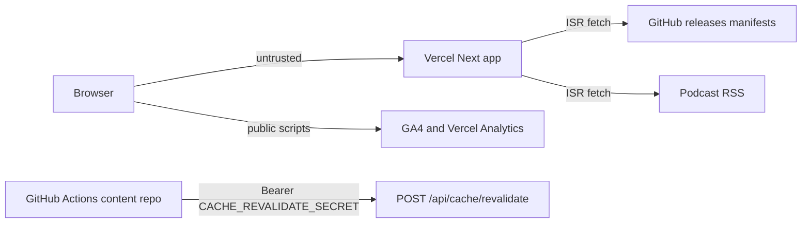

# Defensive security assessment

**Repository:** after-certainty-site  
**Original assessment date:** 2026-07-17  
**Follow-up:** Beehiiv `/api/subscribe` removed; outstanding remediations completed on a later branch.

**Scope:** Static review of the Next.js App Router surface plus localhost-only dynamic tests with outbound services mocked or offline.  
**Constraint:** Dynamic probes use `127.0.0.1` with offline manifest flags and Vitest stubs — no intentional calls to deployed Vercel, GitHub APIs, Beehiiv, or analytics.

Severity rule: **High** only when an attacker can realistically cross a trust boundary or affect confidentiality, integrity, availability, cost, or reputation.

---

## Trust model (current)

There is no end-user authentication and no newsletter/Beehiiv integration. Sensitive trust boundaries are:

1. Shared `CACHE_REVALIDATE_SECRET` (GitHub Actions → site)
2. Integrity of GitHub release manifests and podcast RSS rendered as links and media

---

## Inventory (current)

### Server routes

| Path                               | Methods            | Auth                                   | File                                       |
| ---------------------------------- | ------------------ | -------------------------------------- | ------------------------------------------ |
| `POST /api/cache/revalidate`       | POST               | Bearer `CACHE_REVALIDATE_SECRET`       | `app/api/cache/revalidate/route.ts`        |
| `GET /api/json-ld/patterns/[slug]` | GET                | None                                   | `app/api/json-ld/patterns/[slug]/route.ts` |
| `GET /api/json-ld/concepts/[slug]` | GET                | None                                   | `app/api/json-ld/concepts/[slug]/route.ts` |
| `GET /api/json-ld/books/[slug]`    | GET                | None                                   | `app/api/json-ld/books/[slug]/route.ts`    |
| `GET /feed.xml`                    | GET                | None (307 to env/default RSS)          | `app/feed.xml/route.ts`                    |
| Middleware                         | matched HTML paths | None (Range strip for social crawlers) | `middleware.ts`                            |

`POST /api/subscribe` (Beehiiv) has been **removed**.

No Pages Router API routes. No `"use server"` Server Actions.

### Environment variables

| Name                                                                                    | Client-reachable?                   | Role                           |
| --------------------------------------------------------------------------------------- | ----------------------------------- | ------------------------------ |
| `NEXT_PUBLIC_SITE_URL`                                                                  | Yes                                 | Canonical origin               |
| `NEXT_PUBLIC_SOCIAL_*` / `NEXT_PUBLIC_PODCAST_*` / `NEXT_PUBLIC_GITHUB_DISCUSSIONS_URL` | Yes                                 | Public link overrides          |
| `NEXT_PUBLIC_GA_MEASUREMENT_ID`                                                         | Yes                                 | GA4 (default `G-H7FSEF4WLW`)   |
| `CACHE_REVALIDATE_SECRET`                                                               | No                                  | Revalidate Bearer              |
| `PODCAST_RSS_URL`                                                                       | Value may appear in HTML / redirect | RSS fetch + `/feed.xml` target |
| `SEMANTIC_MANIFEST_URL` / `BOOKS_MANIFEST_URL`                                          | No                                  | ISR fetch URLs                 |
| `*_OFFLINE` / `*_REVALIDATE_SECONDS`                                                    | No                                  | Offline / ISR toggles          |
| `VERCEL_URL`                                                                            | Server fallback for origin          | Platform                       |

`NEWSLETTER_API_KEY` / `NEWSLETTER_PUBLICATION_ID` have been **removed** from `.env.example`.

### External fetches

| Destination       | File                    | Timeout | Failure behavior |
| ----------------- | ----------------------- | ------- | ---------------- |
| Semantic manifest | `lib/graph/manifest.ts` | 10s     | Bundled fallback |
| Books manifest    | `lib/books/manifest.ts` | 10s     | Bundled fallback |
| Podcast RSS       | `lib/podcast/rss.ts`    | 10s     | Bundled fallback |

### GitHub Actions

`.github/workflows/ci.yml`: `permissions: contents: read`; actions SHA-pinned (`checkout` v4.3.1, `setup-node` v4.4.0). No repository secrets. No untrusted interpolation in `run:` steps.

---

## Findings (historical) and status

| ID  | Summary                                               | Severity (at discovery) | Status                                               |
| --- | ----------------------------------------------------- | ----------------------- | ---------------------------------------------------- |
| F1  | No app-level rate limit on newsletter subscribe       | Medium                  | **N/A — route removed**                              |
| F2  | Missing outbound fetch timeouts                       | Medium                  | **Fixed** (`AbortSignal.timeout(10s)`)               |
| F3  | Manifest/RSS URLs not http(s)-only                    | Medium                  | **Fixed** (Zod + normalize + YouTube ids)            |
| F4  | No browser security headers                           | Medium                  | **Fixed** (`SECURITY_HEADERS`)                       |
| F5  | Non-timing-safe revalidate compare; no 401 rate limit | Low                     | **Fixed** (`timingSafeEqual` + unauth IP rate limit) |
| F6  | Subscribe email/body uncapped                         | Low                     | **N/A — route removed**                              |
| F7  | CI missing `permissions` / tag-only pins              | Low                     | **Fixed** (`contents: read` + SHA pins)              |
| F8  | Consent cookie missing `Secure`                       | Low                     | **Fixed** (HTTPS sets `Secure`)                      |

### Additional follow-up

| Item                           | Status                                                       |
| ------------------------------ | ------------------------------------------------------------ |
| MDX `a` href scheme allowlist  | **Fixed** — `isSafeHref` in `mdx-components.tsx`             |
| Beehiiv newsletter API surface | **Removed** — no `/api/subscribe`, no Beehiiv analytics stub |

### Positive controls

| Topic                                    | Assessment                                              |
| ---------------------------------------- | ------------------------------------------------------- |
| JSON-LD XSS                              | Mitigated — `<` escaped in `components/seo/json-ld.tsx` |
| Request SSRF / user-driven open redirect | Not found                                               |
| Secret exposure in client                | No `NEXT_PUBLIC_` on revalidate secret                  |

---

## Dynamic test harness

- `app/api/security-assessment.dynamic.test.ts` (revalidate + feed; rate-limit on failed auth)
- `app/api/cache/revalidate/route.test.ts`
- `lib/security/security.test.ts`

Beehiiv subscribe cases were retired with the route.
