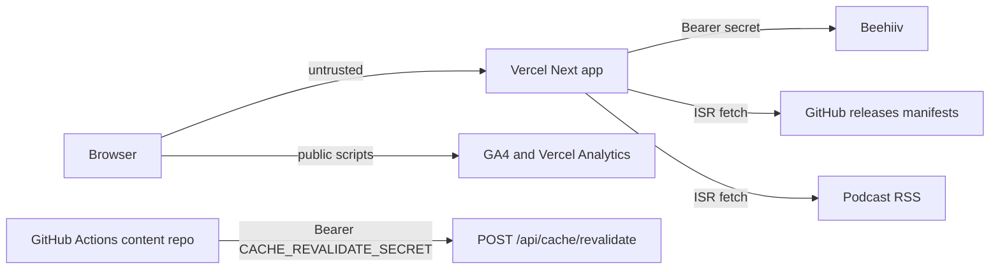

# Defensive security assessment

**Repository:** after-certainty-site  
**Date:** 2026-07-17  
**Scope:** Static review of the Next.js App Router surface plus localhost-only dynamic tests with all outbound services mocked.  
**Constraint:** No requests to deployed Vercel, GitHub APIs, Beehiiv, analytics, or other third-party systems as part of this assessment’s test design. Dynamic probes use `127.0.0.1` with offline manifest flags and Vitest `fetch` stubs.

Severity rule used for this site: **High** only when an attacker can realistically cross a trust boundary or affect confidentiality, integrity, availability, cost, or reputation. Theoretical issues without a realistic path are capped at Medium/Low.

---

## Trust model

There is no end-user authentication. Sensitive trust boundaries are:

1. Shared `CACHE_REVALIDATE_SECRET` (GitHub Actions → site)
2. Beehiiv `NEWSLETTER_API_KEY` / publication ID (server only)
3. Integrity of GitHub release manifests and podcast RSS rendered as links and media

---

## Inventory

### Server routes

| Path                               | Methods            | Auth                                   | File                                       |
| ---------------------------------- | ------------------ | -------------------------------------- | ------------------------------------------ |
| `POST /api/subscribe`              | POST               | None                                   | `app/api/subscribe/route.ts`               |
| `POST /api/cache/revalidate`       | POST               | Bearer `CACHE_REVALIDATE_SECRET`       | `app/api/cache/revalidate/route.ts`        |
| `GET /api/json-ld/patterns/[slug]` | GET                | None                                   | `app/api/json-ld/patterns/[slug]/route.ts` |
| `GET /api/json-ld/concepts/[slug]` | GET                | None                                   | `app/api/json-ld/concepts/[slug]/route.ts` |
| `GET /api/json-ld/books/[slug]`    | GET                | None                                   | `app/api/json-ld/books/[slug]/route.ts`    |
| `GET /feed.xml`                    | GET                | None (307 to env/default RSS)          | `app/feed.xml/route.ts`                    |
| Middleware                         | matched HTML paths | None (Range strip for social crawlers) | `middleware.ts`                            |

No Pages Router API routes. No `"use server"` Server Actions.

Explore pages accept `q`, `page`, `slug`, and focus query params with in-memory filtering (`app/explore/**`).

### Environment variables

| Name                                                                                    | Client-reachable?                   | Role                           |
| --------------------------------------------------------------------------------------- | ----------------------------------- | ------------------------------ |
| `NEXT_PUBLIC_SITE_URL`                                                                  | Yes                                 | Canonical origin               |
| `NEXT_PUBLIC_SOCIAL_*` / `NEXT_PUBLIC_PODCAST_*` / `NEXT_PUBLIC_GITHUB_DISCUSSIONS_URL` | Yes                                 | Public link overrides          |
| `NEXT_PUBLIC_GA_MEASUREMENT_ID`                                                         | Yes                                 | GA4 (default `G-H7FSEF4WLW`)   |
| `NEWSLETTER_API_KEY`                                                                    | No                                  | Beehiiv Bearer                 |
| `NEWSLETTER_PUBLICATION_ID`                                                             | No                                  | Beehiiv path segment           |
| `CACHE_REVALIDATE_SECRET`                                                               | No                                  | Revalidate Bearer              |
| `PODCAST_RSS_URL`                                                                       | Value may appear in HTML / redirect | RSS fetch + `/feed.xml` target |
| `SEMANTIC_MANIFEST_URL` / `BOOKS_MANIFEST_URL`                                          | No                                  | ISR fetch URLs                 |
| `*_OFFLINE` / `*_REVALIDATE_SECONDS`                                                    | No                                  | Offline / ISR toggles          |
| `VERCEL_URL`                                                                            | Server fallback for origin          | Platform                       |

Documented in `.env.example`. No committed secret `.env` files.

### External fetches (operator/env destinations only)

| Destination                                 | File                              | Timeout  | Failure behavior                               |
| ------------------------------------------- | --------------------------------- | -------- | ---------------------------------------------- |
| Beehiiv subscriptions API                   | `app/api/subscribe/route.ts` ~L57 | **None** | Generic 500/502; Beehiiv message length-capped |
| Semantic manifest (GitHub releases default) | `lib/graph/manifest.ts` ~L159     | **None** | Bundled `data/semantic-manifest.json`          |
| Books manifest                              | `lib/books/manifest.ts` ~L59      | **None** | Bundled fallback                               |
| Podcast RSS                                 | `lib/podcast/rss.ts` ~L54         | **None** | Bundled `data/podcast-episodes.json`           |

No request-time SSRF: fetch URLs are not taken from request query/body. Image remote allowlist in `next.config.ts` (`cloudfront`, `raw.githubusercontent.com/ksteffe/after-certainty/**`).

### User-controlled input flows

| Input                       | Enters                          | Flows to                                     |
| --------------------------- | ------------------------------- | -------------------------------------------- |
| JSON `email`                | `POST /api/subscribe`           | Trim → regex → Beehiiv body                  |
| `Authorization`             | `POST /api/cache/revalidate`    | Compared to env secret                       |
| JSON `targets[]`            | revalidate body                 | Allowlist `podcast` \| `semantic` \| `books` |
| Path `slug`                 | `/api/json-ld/*/[slug]`         | Map lookup → JSON-LD                         |
| `q` / `page` / focus params | Explore pages                   | In-memory filter / clamp                     |
| RSS / manifest fields       | Server fetch (trusted upstream) | `href` / `src` / iframe embeds               |

### GitHub Actions

`.github/workflows/ci.yml`: `npm ci`, `npm audit --audit-level=high`, lint, test, build (offline manifests), Playwright. No repository secrets. No untrusted interpolation in `run:` steps. Missing explicit `permissions:`. Actions pinned to major tags (`@v4`), not commit SHAs.

---

## Findings

### F1 — No app-level rate limit on newsletter subscribe

| Field                     | Detail                                                                                      |
| ------------------------- | ------------------------------------------------------------------------------------------- |
| **File / line**           | `app/api/subscribe/route.ts` L24–108                                                        |
| **Exploit prerequisites** | Public `POST`; no CAPTCHA or Origin check. UI not shipped yet; API is reachable.            |
| **Realistic impact**      | Beehiiv quota burn and spam signups (cost + reputation). Upstream 429 is the only throttle. |
| **Confidence**            | High                                                                                        |
| **Severity**              | **Medium**                                                                                  |
| **Smallest remediation**  | In-memory rate limit by IP + email; reject oversized bodies; max email length 254           |
| **Regression test**       | `app/api/subscribe/route.test.ts` / security suite — burst → 429; long email → 400          |

### F2 — Missing outbound fetch timeouts

| Field                     | Detail                                                                                                                |
| ------------------------- | --------------------------------------------------------------------------------------------------------------------- |
| **File / line**           | `app/api/subscribe/route.ts` L57; `lib/graph/manifest.ts` L159; `lib/books/manifest.ts` L59; `lib/podcast/rss.ts` L54 |
| **Exploit prerequisites** | Hung or extremely slow upstream (or mis-set env URL)                                                                  |
| **Realistic impact**      | Worker hang / degraded availability for subscribe and ISR refresh paths                                               |
| **Confidence**            | High                                                                                                                  |
| **Severity**              | **Medium**                                                                                                            |
| **Smallest remediation**  | `AbortSignal.timeout(ms)` on all four fetches; keep existing fallbacks                                                |
| **Regression test**       | Mock never-resolving `fetch` → subscribe errors safely; manifests return fallback                                     |

### F3 — Manifest/RSS URLs not restricted to http(s) before href/src

| Field                     | Detail                                                                                                               |
| ------------------------- | -------------------------------------------------------------------------------------------------------------------- |
| **File / line**           | `lib/graph/schemas.ts` (`z.string().url()` at L10, 25, 33, 47, 58–61, 136, 170); `lib/podcast/normalize.ts` L102–114 |
| **Exploit prerequisites** | Compromised GitHub `latest` release or hostile RSS feed                                                              |
| **Realistic impact**      | `javascript:` / non-http schemes in links or audio `src`; phishing / XSS-adjacent for visitors                       |
| **Confidence**            | Medium–High (requires supply-chain breach; Zod currently accepts non-http URL schemes)                               |
| **Severity**              | **Medium**                                                                                                           |
| **Smallest remediation**  | Shared http(s)-only Zod helper; drop bad enclosure URLs in normalize; constrain YouTube IDs                          |
| **Regression test**       | Hostile URL fails schema / is dropped; invalid YouTube id rejected                                                   |

### F4 — No browser security headers in-repo

| Field                     | Detail                                                                                                 |
| ------------------------- | ------------------------------------------------------------------------------------------------------ |
| **File / line**           | `next.config.ts` (no `headers()`); `middleware.ts`                                                     |
| **Exploit prerequisites** | Framing site or exploiting a future XSS                                                                |
| **Realistic impact**      | Clickjacking / missing CSP depth. Session value is low (consent cookie only).                          |
| **Confidence**            | High (absence confirmed dynamically — all listed headers MISSING on `/`)                               |
| **Severity**              | **Medium** (defense-in-depth; not High per trust-boundary rule)                                        |
| **Smallest remediation**  | `headers()` with nosniff, Referrer-Policy, Permissions-Policy, frame-ancestors/XFO, baseline CSP, HSTS |
| **Regression test**       | Assert header helper / config exports expected header map                                              |

### F5 — Revalidate bearer compare not timing-safe; no rate limit on failures

| Field                     | Detail                                                                        |
| ------------------------- | ----------------------------------------------------------------------------- |
| **File / line**           | `lib/cache/revalidate.ts` L16–20                                              |
| **Exploit prerequisites** | High-volume timing measurements over TLS (impractical at scale)               |
| **Realistic impact**      | Theoretical secret oracle; if secret leaks, forced cache churn                |
| **Confidence**            | High on code; Low on practical exploitability                                 |
| **Severity**              | **Low**                                                                       |
| **Smallest remediation**  | `crypto.timingSafeEqual` on equal-length buffers; optional soft limit on 401s |
| **Regression test**       | Wrong/missing token → 401; correct → 200; length mismatch → 401               |

### F6 — Subscribe email length / body size uncapped

| Field                     | Detail                                                                       |
| ------------------------- | ---------------------------------------------------------------------------- |
| **File / line**           | `app/api/subscribe/route.ts` L42–45                                          |
| **Exploit prerequisites** | Crafted large JSON body or very long “email” matching the weak regex         |
| **Realistic impact**      | Memory/CPU noise; unnecessary upstream attempts                              |
| **Confidence**            | High                                                                         |
| **Severity**              | **Low**                                                                      |
| **Smallest remediation**  | Email ≤ 254 chars; reject bodies over ~4KB before JSON parse where practical |
| **Regression test**       | Oversized email/body → 400 without calling `fetch`                           |

### F7 — CI missing explicit `permissions`

| Field                     | Detail                                                 |
| ------------------------- | ------------------------------------------------------ |
| **File / line**           | `.github/workflows/ci.yml` (workflow-wide)             |
| **Exploit prerequisites** | Compromised workflow step or future injection          |
| **Realistic impact**      | Excess default `GITHUB_TOKEN` scope                    |
| **Confidence**            | High                                                   |
| **Severity**              | **Low**                                                |
| **Smallest remediation**  | `permissions: contents: read` at workflow or job level |
| **Regression test**       | N/A (workflow review)                                  |

### F8 — Consent cookie missing `Secure`

| Field                     | Detail                                                |
| ------------------------- | ----------------------------------------------------- |
| **File / line**           | `lib/consent/storage.ts` L25                          |
| **Exploit prerequisites** | HTTP (non-localhost) or MITM                          |
| **Realistic impact**      | Consent value readable/set on insecure transport      |
| **Confidence**            | High                                                  |
| **Severity**              | **Low**                                               |
| **Smallest remediation**  | Append `Secure` when `location.protocol === 'https:'` |
| **Regression test**       | Extend `lib/consent/storage.test.ts`                  |

### Not findings / positive controls

| Topic                         | Assessment                                                     |
| ----------------------------- | -------------------------------------------------------------- |
| JSON-LD XSS                   | Mitigated — `<` escaped in `components/seo/json-ld.tsx` L15–16 |
| Request SSRF                  | Not found — fetch URLs are env/default only                    |
| Open redirect from user input | Not found — `/feed.xml` uses env/default RSS only              |
| Secret exposure in client     | No `NEXT_PUBLIC_` on Beehiiv/revalidate secrets                |
| Verbose API errors            | Generic client messages; Beehiiv message length-capped         |
| MDX HTML                      | No `.mdx` pages today; future risk only                        |
| Auth on public JSON-LD GETs   | Expected for this public content site                          |

---

## Dynamic test results (localhost + mocks)

**Harness:**

- Vitest: `app/api/security-assessment.dynamic.test.ts` (Beehiiv/`fetch` stubbed)
- Existing: `app/api/subscribe/route.test.ts`, `app/api/cache/revalidate/route.test.ts`
- Local `next start` on `127.0.0.1:3000` with `BOOKS_MANIFEST_OFFLINE=1`, `SEMANTIC_MANIFEST_OFFLINE=1`, curl `--max-redirs 0`

| Case                                                     | Result                                                                  | Notes                                                        |
| -------------------------------------------------------- | ----------------------------------------------------------------------- | ------------------------------------------------------------ |
| Unsupported methods on subscribe/revalidate/json-ld/feed | **Pass** — 405 (OPTIONS on subscribe → 204)                             | Next default method handling                                 |
| Revalidate missing / wrong / Basic auth                  | **Pass** — 401                                                          |                                                              |
| Revalidate valid Bearer                                  | **Pass** — 200                                                          | Vitest mocks refresh; live probe avoided for podcast network |
| Revalidate secret unset                                  | **Pass** — 503                                                          | Vitest                                                       |
| Invalid JSON (subscribe/revalidate)                      | **Pass** — 400                                                          |                                                              |
| Empty / invalid email                                    | **Pass** — 400                                                          |                                                              |
| Oversized body with invalid email                        | **Pass** — 413 (after F6)                                               | No outbound                                                  |
| Unknown / empty `targets`                                | **Pass** — 400                                                          |                                                              |
| Huge invalid `targets` array                             | **Pass** — 400                                                          | Vitest                                                       |
| Beehiiv network reject (mocked)                          | **Pass** — 502, no secret/stack leak                                    |                                                              |
| Beehiiv 5xx (mocked)                                     | **Pass** — 502, sanitized message                                       |                                                              |
| Oversized Beehiiv error message                          | **Pass** — replaced with generic                                        |                                                              |
| Newsletter env missing                                   | **Pass** — 500 unavailable message                                      | Live + Vitest                                                |
| Malformed manifests / RSS down                           | **Pass** (existing unit/integration)                                    | Offline fallbacks                                            |
| JSON-LD known / unknown / long slug                      | **Pass** — 200 / 404 / 404                                              | No crash on 2000-char slug                                   |
| `/feed.xml`                                              | **Pass** — 307 to default Anchor URL                                    | Redirect target not user-controlled                          |
| Security headers on `/`                                  | **Pass (after F4)** — CSP/XFO/nosniff/Referrer/Permissions/HSTS present | Confirmed on local `next start`                              |
| App-level rate limit after burst                         | **Pass (after F1)** — 6th same-email request → 429                      | Vitest mocked Beehiiv                                        |

---

## Remediation status (Phase 2 — implemented)

| Finding            | Status    | Notes                                                   |
| ------------------ | --------- | ------------------------------------------------------- |
| F1 rate limit      | **Fixed** | In-memory IP + email limits on `/api/subscribe`         |
| F2 timeouts        | **Fixed** | `AbortSignal.timeout(10s)` on Beehiiv, manifests, RSS   |
| F3 http(s) URLs    | **Fixed** | Zod `httpUrlSchema` + RSS normalize + YouTube id checks |
| F4 headers         | **Fixed** | `SECURITY_HEADERS` via `next.config.ts` `headers()`     |
| F5 timing-safe     | **Fixed** | `timingSafeEqual` on revalidate bearer                  |
| F6 body/email caps | **Fixed** | 4KB body / 254-char email                               |
| F7 CI permissions  | **Fixed** | `permissions: contents: read`                           |
| F8 Secure cookie   | **Fixed** | `Secure` when `location.protocol === 'https:'`          |

Rate-limit dynamic case: **Pass** after F1 (see `app/api/security-assessment.dynamic.test.ts`).
